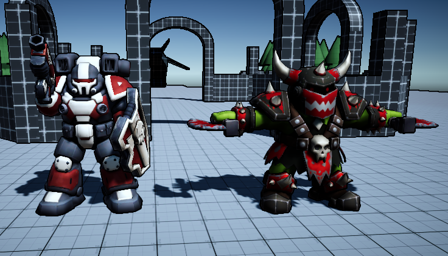
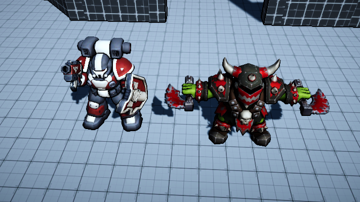
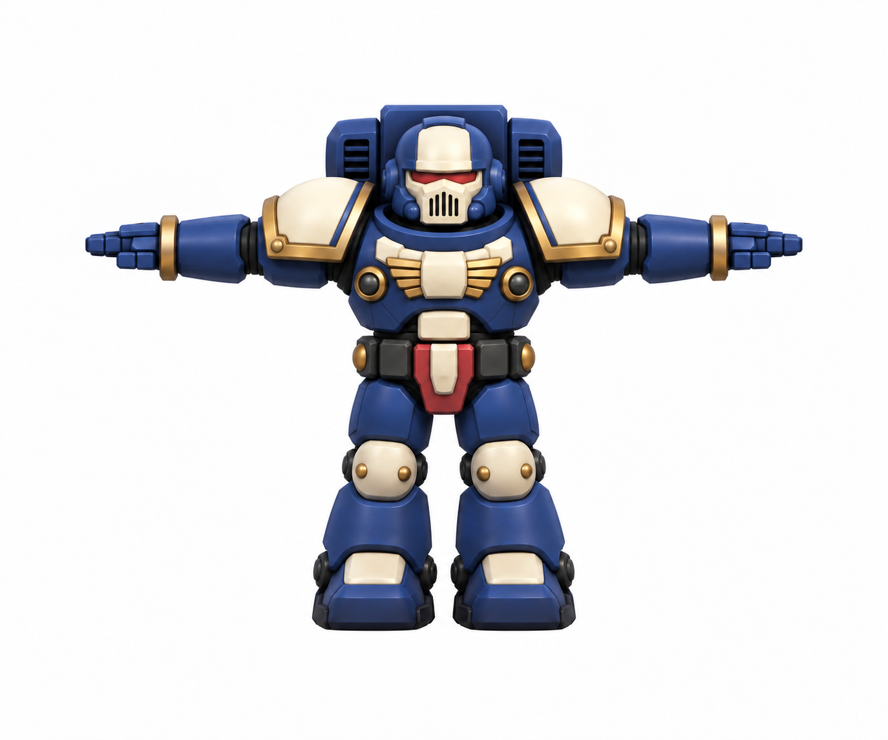
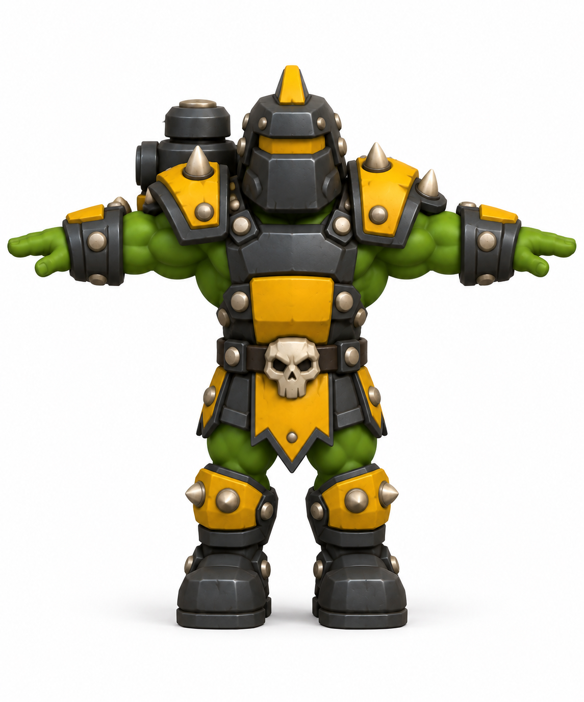
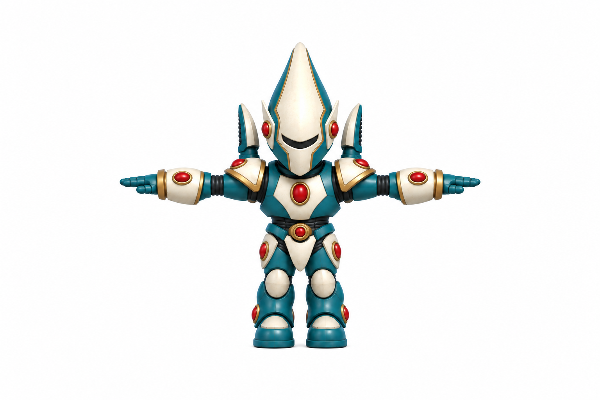
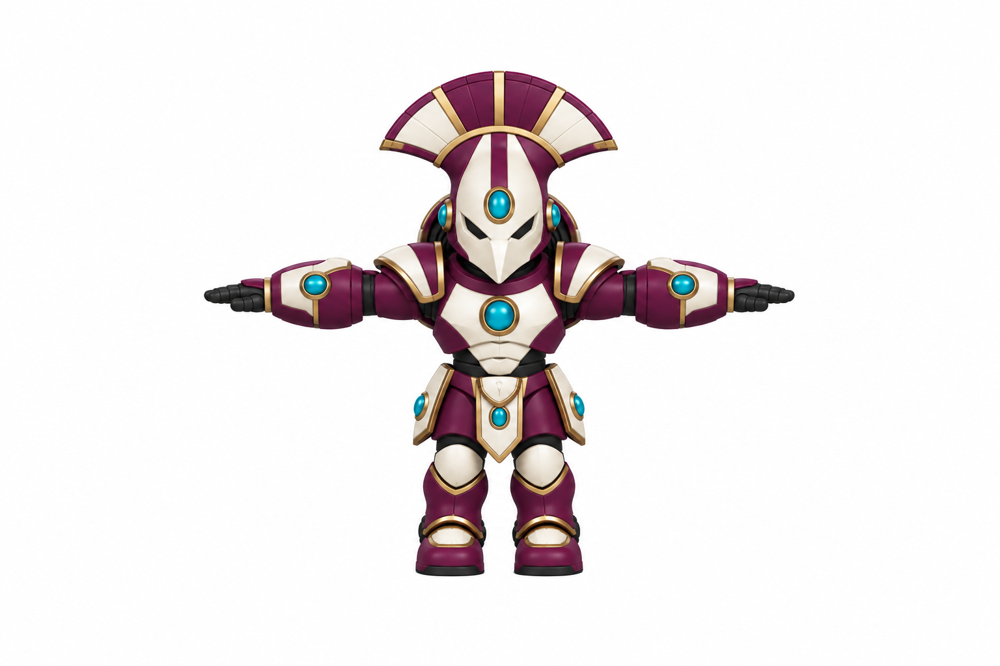
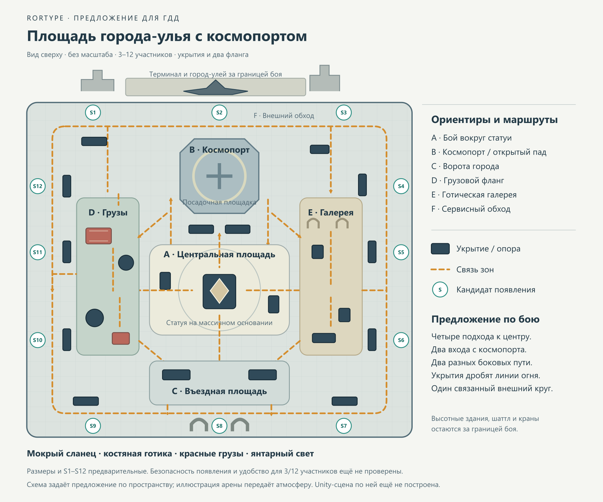
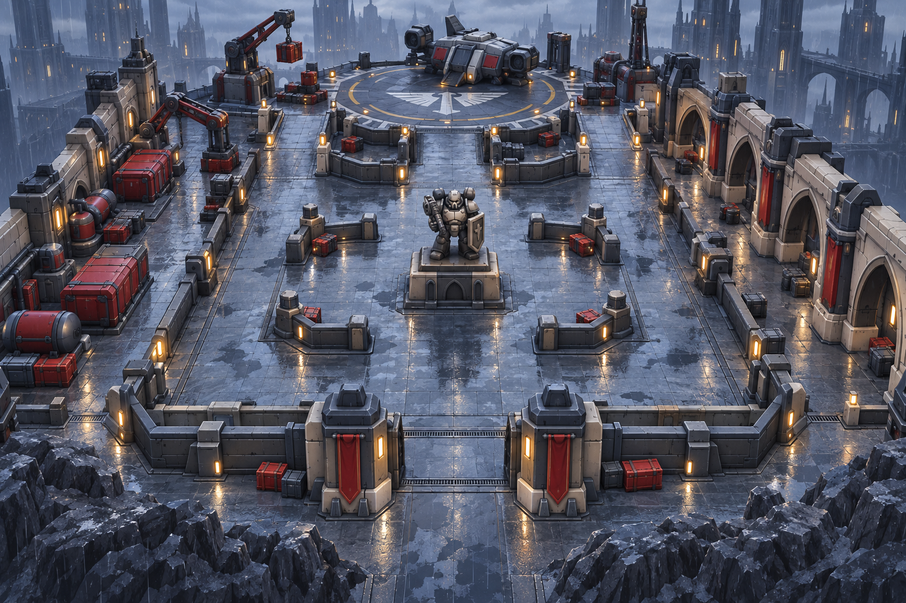

# ГДД и документация проекта RORTYPE

## Обзор

`RORTYPE` сейчас представляет собой Unity-проект на стадии раннего gameplay-прототипа. Репозиторий уже содержит собственное `top-down` движение, combat sandbox, MVP-врагов, порталы, магазины, контейнеры, pickups, миникарту, часть маршрутных интерактивов и несколько gameplay-сцен. Импортированный пакет сторонних контроллеров движения/камеры остается в проекте как внешний ассет, но не является основой текущего игрока.

Актуальная целевая концепция по брифу пользователя от 2026-10-06 — аренный шутер с видом сверху на 3–12 человек: чиби-персонажи, готическое окружение, скалистая планета отшельников с круглогодичным дождём. Уточнённая локация арены — **площадь города-улья с космопортом**. Главный визуальный референс — Warhammer 40,000. Единый ГДД находится в [разделе ниже](#gdd); он фиксирует требования, исходные референсы, новые концепты персонажей и предложение по арене.

`Forest Rises 112.1.6 Дизайн Уровней.docx` сохраняется как исторический источник прежнего roguelite-направления. Его хабы, прогрессия и три локации не становятся требованиями нового аренного формата автоматически. `RtsPrototype` — отдельный прототип. Существующие системы Unity и актуальный замысел нужно рассматривать раздельно:

- что уже реально существует в Unity-проекте
- что требуется по актуальному ГДД и что ещё предстоит определить

## Музыка главного меню — первый эскиз

2026-10-06 пользователь передал напетый мотив и выбрал настроение **«Мрачный и величественный»**. На его основе создан локально синтезированный эскиз длительностью **2:08**: органные и хоровые тембры, низкая педаль, мягкая ведущая мелодия и длинная реверберация. Рисунок шести фраз восстановлен приблизительно по высоте/огибающей записи и замедлен в 1,5 раза; неоднозначные переходы требуют проверки пользователем на слух.

- [Версия для прослушивания, MP3](../AudioProduction/MainMenu/RORTYPE_MainMenu_Ambient_v01_Preview.mp3) — с плавным входом и завершением.
- [WAV для зацикливания](../AudioProduction/MainMenu/RORTYPE_MainMenu_Ambient_v01_LOOP.wav) — stereo, 48 kHz, 24 bit, без затухания на границах; хвосты нот и реверберации перенесены через стык.
- [Мотив отдельно](../AudioProduction/MainMenu/Motif_Check.wav) и [MIDI](../AudioProduction/MainMenu/Motif_Approximation.mid) — для проверки мелодии и дальнейшего редактирования.
- Ноты, подробности транскрипции, исходник синтеза и отчёт проверки находятся в `AudioProduction/MainMenu/`.

Техническая проверка: -20 LUFS, true peak -8,41 dBTP, клиппинг отсутствует; амплитудный скачок на стыке меньше обычных изменений внутри сигнала. Это проверка данных, а не прослушивание. Статус: **аудиоэскиз для пользовательского ревью**, к сцене главного меню ещё не подключён.

## Источники правды

### Текущая реализация

- Основные существующие сцены: `Assets/Game/Scene/Level_1.unity`, `Assets/Game/Scene/Level_2.unity`, `Assets/Game/Scene/Hub_1.unity`, `Assets/Game/Scene/PlayerMovementTest.unity`
- Важно: `ProjectSettings/EditorBuildSettings.asset` также ссылается на `Hub_2.unity` и `Level_3.unity`, но эти `.unity` файлы сейчас не найдены в `Assets/Game/Scene`
- Настройки проекта: `ProjectSettings/`
- Пакеты Unity: `Packages/manifest.json`

### Целевой дизайн

- Актуальный источник требований: бриф пользователя от 2026-10-06, зафиксированный в [ГДД](#gdd).
- Визуальные источники: два пользовательских изображения, сохранённые в `docs/references/` и встроенные в ГДД.
- Исторический источник прежнего направления: `C:\Users\senne\Downloads\Forest Rises 112.1.6 Дизайн Уровней.docx`.

### Постоянный контекст проекта

- Память проекта: `docs/project-memory.md`
- Инструкции для агентов: `AGENTS.md`

## ГДД: актуальная концепция игры

Дата фиксации: **2026-10-06**. Статус: **целевой дизайн**. Обязательные требования ниже взяты из брифа пользователя. Разделы с пометкой «предложение» содержат рабочие варианты для дальнейшего согласования; они не означают, что арена, шесть игровых персонажей или матч на 12 человек уже реализованы в Unity.

### Идея и основные требования

Короткая формулировка: выразительные чиби-бойцы сражаются на готической площади города-улья с космопортом, среди мокрого камня и крупных промышленных форм дождливой скалистой планеты отшельников. Визуальное впечатление строится на крупных сочных формах, узнаваемых цветах и читаемом бое с верхней камеры.

| Параметр | Требование пользователя |
| --- | --- |
| Главный референс | Warhammer 40,000 |
| Жанр и камера | Аренный шутер с видом сверху / наклонной top-down камерой |
| Участники | От 3 до 12 человек |
| Персонажи | 6 разных обликов: 2 космодесантника, 2 орка, 2 эльдара |
| Художественный стиль | Чиби-персонажи и подходящее им по формам и пропорциям окружение |
| Настроение | Чиби дарк-фэнтези с готическим окружением |
| Биом | Скалистая планета отшельников; дождь идёт круглый год |
| Локация арены | Площадь города-улья с космопортом |
| Пространство боя | Арена с укрытиями, обходными путями и понятной схемой |
| Модели | Mid-poly; умеренная детализация, приоритет выразительным крупным формам |
| Цвет | Насыщенные узнаваемые цвета, привлекательная композиция; правило 60% / 30% / 10% |

### Игровая основа и границы решений

На уровне жанра игрок перемещается по арене, целится и стреляет, использует укрытия, меняет позицию и выбирает прямой или обходной путь к боевому контакту. Арена должна давать выбор маршрута, а не сводить весь бой к одному проходу.

**Пока не определены:** PvP/PvE или их сочетание, командный формат, условия победы, длительность матча, возрождение, выбор и повторение персонажей, оружие и способности, наличие ближнего боя, прогрессия, платформа и способ сетевого подключения. Число 3–12 фиксирует требуемое количество людей, но не задаёт деление на команды или соотношение фракций. Шесть обликов не означают шесть утверждённых боевых классов.

Щит, ранцы, топоры и другие предметы на изображениях служат визуальными референсами. Они сами по себе не утверждают блокирование урона, полёт, ближний бой или конкретные характеристики оружия. Существующие магазины, лут, активные навыки и другие системы прототипа также требуют отдельного решения об использовании в аренном режиме.

### Управление, движение и стрельба

Актуальная схема пользователя от 2026-10-07: движение, прицеливание и вращение камеры по образцу Foxhole. Она заменяет предыдущий вариант с постоянным разворотом к мыши и самостоятельным огнём на ЛКМ.

| Действие | Клавиатура и мышь | Геймпад |
| --- | --- | --- |
| Движение относительно экрана | WASD; также стрелки | Левый стик |
| Направление взгляда без прицеливания | По направлению WASD; при остановке сохраняется | По направлению левого стика; при остановке сохраняется |
| Режим прицеливания | Удержание ПКМ; персонаж смотрит к мыши | Удержание LT; правый стик задаёт направление |
| Огонь в режиме прицеливания | ЛКМ при удерживаемой ПКМ | RT при удерживаемом LT |
| Вращение камеры | Удержание колёсика и движение мыши влево/вправо | Отдельная кнопка не назначена |
| Бег | Удержание Shift | Нажатие левого стика включает/выключает бег |
| Перезарядка | R | X / □ |
| Взаимодействие | E | A / × |
| Быстрый защитный манёвр | Space | LB / L1 |
| Существующая радиальная способность | 1 | Крестовина влево |
| Выбор точки для существующей липкой бомбы | 2 | Крестовина вверх |
| Подтвердить / отменить выбор точки | ЛКМ / Esc | RT / B / ○ |

Без прицеливания персонаж поворачивается по направлению движения и использует обычный бег вперёд: W — вверх экрана, A — влево, S — вниз, D — вправо. Одновременные кнопки дают диагональное направление. Мышь в этом режиме не разворачивает корпус; после остановки он сохраняет последний поворот. Только при удержании ПКМ/LT корпус направлен к прицелу, а движение относительно него выбирает переднюю, заднюю или боковую анимацию. При отпускании прицеливания боковое/заднее смешивание сразу сбрасывается в обычный бег. На геймпаде правый стик сохраняет последнее направление прицела в мире после отпускания.

Камера вращается по горизонтали вокруг персонажа, пока зажато колёсико; после отпускания сохраняет полученный угол. Направления WASD остаются относительно экрана после поворота камеры. В Jagernauts ссылка направления движения исправлена: она указывает на существующую TopDownCamera, а не на поворачивающийся CHARACTER. Одновременное удержание ПКМ и колёсика поддерживается, как в [Foxhole начиная с Update 60](https://www.foxholegame.com/post/update-60-release-notes). Смещение обзора к прицелу действует только в режиме прицеливания; обычный бег возвращает камеру к персонажу.

Авторское подпрыгивание root-кости сохраняется в беге и боковых шагах. При импорте вертикальное движение остаётся в позе скелета через `Root Transform Position (Y) → Bake Into Pose`, а горизонтальное root motion передаётся физическому мотору. Это [штатная настройка Unity для сохранения Y в анимации костей](https://docs.unity3d.com/6000.3/Documentation/ScriptReference/ModelImporterClipAnimation-lockRootHeightY.html). Generic-риг использует `CTRL_root`; явный Motion override снят, поскольку он [перекрывает поклиповые настройки](https://docs.unity3d.com/cn/2022.3/Manual/AnimationRootMotionNodeOnImportedClips.html). Параметры сохранены 2026-10-07; подпрыгивание после повторного импорта ещё требует визуальной проверки в Unity.

Огонь доступен только в режиме прицеливания. После входа в режим, бега или резкого поворота персонаж сначала выравнивается по прицелу и проходит короткую подготовку оружия: исходное время 0,22 секунды. Вне прицеливания подготовка и устойчивость сбрасываются; ЛКМ/RT не запускает обычный выстрел и не прерывает sprint. Попадание, расход патрона и запуск анимации Fire происходят одним событием выстрела; короткий клик сохраняется до готовности оружия, пока удерживается прицеливание. Отпускание ПКМ/LT отменяет ещё не выполненный запрос. Анимация Fire накладывается на верхнюю часть тела, а ноги продолжают движение. Во время выстрела множитель скорости sprint не ускоряет Fire. В HUD отдельная маленькая латунная метка показывает фактическое направление оружия, а основной прицел — желаемое направление.

Наведение курсора на интерфейс блокирует боевые действия, но позволяет продолжать движение и бег. Открытый магазин, выбор портала, пауза и потеря фокуса окна блокируют управление целиком.

Точность повышается при стабильном направлении прицела после остановки. Исходное время стабилизации — 0,8 секунды; движение оставляет больший разброс. Бег, защитный манёвр и резкий разворот сбрасывают подготовку и устойчивость. Сам выстрел слегка снижает устойчивость, поэтому паузы между выстрелами помогают точности. Sprint отключается при прицеливании и до завершения выстрела; во время защитного манёвра огонь невозможен. Основной прицел состоит из полукруглой дуги и сплошной центральной точки: дуга расширяется по разбросу, точка сохраняет свой размер, цвет обоих элементов отражает готовность и устойчивость в режиме прицеливания. Эти числа — начальная настройка прототипа, а не проверенный баланс.

Магазин вмещает 30 патронов, исходная перезарядка занимает 2 секунды. До её завершения стрелять и применять боевые способности нельзя; перемещение и отход остаются доступны. Перезарядка вручную пополняет магазин из запаса, не создаёт новых патронов и не расходует остаток частично заполненного магазина. HUD показывает магазин и запас. Подбор и покупка увеличивают общий запас. Состояние магазина сохраняется вместе с существующим переносом ресурсов между сценами; переход и возрождение не пополняют магазин бесплатно. Отладочный возврат в безопасную точку перенесён с R на Home.

Попадание обычного болтера определяется мгновенным горизонтальным лучом от оружия с учётом разброса и дальности. Мышь задаёт точку, а правый стик — направление луча. Ближайшая доступная цель получает урон; твёрдые препятствия и укрытия останавливают выстрел, в том числе если ствол выступил сквозь них. Объект пули и время полёта отсутствуют. Визуальные эффекты обычного выстрела будут реализованы позже: сейчас остаётся анимация персонажа без вспышки, следа, эффекта попадания и деформации тела.

На геймпаде поворот прицела слегка замедляется возле живой видимой цели, но прицел не притягивается к ней и не переключает цели автоматически. Для липкой бомбы открывается отдельный наземный прицел: мышь задаёт точку, правый стик перемещает её по поверхности. Дальность ограничена радиусом способности. Красный прицел означает отсутствие подходящей поверхности; такой бросок нельзя подтвердить. Отмена не расходует способность и не запускает её откат. Подтверждение создаёт экземпляр готового префаба бомбы: она летит к выбранной позиции, прилипает при столкновении либо останавливается в выбранной точке и взрывается после запала. Нажатие подтверждения не вызывает дополнительный выстрел болтера. Радиальная способность сохраняет своё прежнее действие и также использует подготовленный префаб.

Правило подготовки оружия опирается на предложенный пользователем принцип влияния позиции, времени прицеливания и движения, описанный в [Project Zomboid: Aiming to Please](https://projectzomboid.com/blog/news/2014/07/aiming-to-please/). Конкретные значения и поведение выше относятся к нашему прототипу.

Схема внесена в код, существующие префабы игрока/камеры, сцены с отдельными компонентами и HUD. Кнопка камеры настраивается в `TopDownInputAdapter`, чувствительность — в `TopDownCameraRig.rotationSensitivity`; Jagernauts наследует новые значения из DESANTGAME-префабов. Для геймпада используется Input System 1.14.0, полностью сохранённый в `Packages/com.unity.inputsystem` как [встроенный пакет Unity](https://docs.unity3d.com/2022.3/Documentation/Manual/upm-embed.html). Первоначальная registry-зависимость 1.19.0 не загрузилась из-за ENOTFOUND сервера Unity и блокировала компиляцию; она удалена. Для этого пакета скачивание больше не требуется. Режим Both сохраняет существующий старый ввод интерфейсов; после импорта Unity нужно перезапустить для включения нового ввода, как описано в [руководстве Unity](https://docs.unity3d.com/Packages/com.unity.inputsystem@1.14/manual/Installation.html). У префаба `PlayerStickyBombExplosion` сохранена ссылка на существующий `TransientScaleEffect` и явно указан класс компонента. Исправление ошибок пакета подтверждено по Editor.log. Новая схема от 2026-10-07 проверена чтением исходников и сериализованных данных; Play Mode агентом не запускался. Первый практический сценарий проверки: пробежать по WASD без ПКМ → повернуть камеру колёсиком и повторить WASD → зажать ПКМ и пройти боком/спиной → выстрелить → отпустить ПКМ и вернуться к обычному бегу.

После первого импорта встроенного пакета Unity создал `Unity.InputSystem.dll` и `Assembly-CSharp.dll`, но весь цикл компиляции остановился на служебных IntegrationTests, требовавших отсутствующий NUnit/Test Framework. В двух asmdef пакета исправлены [условия подключения сборки](https://docs.unity3d.com/2022.3/Documentation/Manual/ScriptCompilationAssemblyDefinitionFiles.html#conditional-assembly): тестовые сборки включаются только при установленном `com.unity.test-framework` версии 1.0.0 или новее. Дополнительный пакет для этого не устанавливался. При обновлении встроенного Input System следует сохранить эти локальные поправки, если Test Framework по-прежнему отсутствует. Повторный импорт префаба взрыва прошёл без прежнего предупреждения о компоненте. Повторный автоматический импорт после поправок asmdef успешно завершился 2026-10-06 в 23:23:48: Unity загрузил все сборки и выполнил domain reload, новых ошибок и предупреждений компилятора нет.

Runtime-код игровых правил разрешён по уточнению пользователя. Игровые объекты, компоненты, материалы и визуальные связи готовятся в сценах и префабах; во время игры создаются экземпляры готовых ассетов, если механике нужны объекты. Обычный выстрел болтера объект не создаёт. Параметры ввода, разворота, подготовки, точности, магазина, перезарядки и попадания доступны в Inspector.

### Визуальная грамматика персонажей

Обязательный принцип: **привлекать сочными формами, а не количеством мелких деталей**. В силуэте важны голова/шлем, наплечники, нарукавники, ранец, оружие и крупный персональный акцент. Мелкие заклёпки, надписи, царапины и орнамент вторичны.

- Чиби-пропорции: крупная голова или шлем, компактный корпус, короткие конечности и массивные кисти/обувь. Конкретные пропорции задавать по приложенным моделям, без обязательного одинакового отношения головы к росту для всех фракций.
- По уточнению пользователя лица закрывать целиком непрозрачными шлемами и масками: без открытой кожи лица, глаз, рта и органических зубов/клыков. Характер передавать формой шлема, гребня и лицевой бронепластины; это упрощает дальнейшую ИИ-генерацию моделей.
- Mid-poly направлять на контур, объём и широкие фаски, читаемые с игровой камеры. Полигональный бюджет и размер текстур пока не назначены.
- Каждый облик должен иметь собственное сочетание верхнего силуэта, плечевого пояса, ранца и оружия. Перекраска той же модели недостаточна для требования «два разных».
- Цвет дополняет форму: персонажей необходимо различать и при ослабленной насыщенности. Фракционная палитра не заменяет отдельное обозначение команды, если командный режим будет выбран.
- Детали должны сохраняться при движении и с наклонного вида сверху. Рога, края наплечников, шлемы и ранцы особенно важны в этом ракурсе.

### Состав персонажей

В брифе утверждён состав из шести персонажей. Два исходных изображения показывают **один облик космодесантника и один облик орка** в двух ракурсах. Для остальных четырёх обликов созданы отдельные объёмные концепты в фас, в Т-позе на белом фоне, с полностью закрытыми лицами; они находятся в разделе ниже и остаются предложениями до выбора пользователем.

| Облик | Зафиксированное визуальное направление | Статус |
| --- | --- | --- |
| Космодесантник 1 | Белая/костяная броня, красные крупные вставки, тёмные сочленения; широкий плечевой пояс, закрытый шлем, массивные ботинки, заметный ранец, оружие и щит | Подтверждён приложенными изображениями как визуальный референс |
| Космодесантник 2 | Тяжёлая сине-костяная броня, округлый полностью закрытый шлем, крупные наплечники с латунным краем, массивный ранец и ботинки | Создан отдельный фронтальный концепт; финальный облик ещё не выбран |
| Орк 1 | Зелёные открытые руки, чёрно-красная броня; широкий рогатый шлем, зубастый красно-белый рисунок на лицевой части, крупные шипы, череп на поясе, парные топоры | Подтверждён приложенными изображениями как визуальный референс |
| Орк 2 | Зелёная кожа рук, угольно-жёлтые пластины, полностью закрытый шлем с клиновидным гребнем и массивной нижней маской, тяжёлый ранец | Создан отдельный фронтальный концепт; финальный облик ещё не выбран |
| Эльдар 1 | Бирюзово-костяная броня, вытянутый плавный полностью закрытый шлем, небольшой плечевой пояс и парные изогнутые элементы ранца | Создан отдельный фронтальный концепт; финальный облик ещё не выбран |
| Эльдар 2 | Пурпурно-костяная броня, полностью закрытая клювовидная маска и другая композиция гребня, наплечников и ранца при общей чиби-стилистике эльдаров | Создан отдельный фронтальный концепт; финальный облик ещё не выбран |

**Направления новых концептов, не утверждённые классы:**

- Космодесантник 2: более цельный тяжёлый контур, другая форма шлема и асимметричный наплечник; крупное двуручное оружие вместо сочетания оружия и щита. Возможная палитра — насыщенный синий, костяной и небольшой латунный акцент.
- Орк 2: приземистый контур, короткий шлем без длинных боковых рогов, один особенно крупный нарукавник и массивное стрелковое оружие. Возможная палитра — зелёная кожа, тёмный металл и жёлто-оранжевые акценты вместо красного первого орка.
- Эльдар 1: вытянутый каплевидный шлем, плавные компактные наплечники и узкий корпус при крупной чиби-голове. Возможная палитра — бирюзовый, костяной и небольшой тёплый акцент.
- Эльдар 2: широкий веер или пара изогнутых элементов за головой, иная форма шлема и крупные плавные нарукавники. Возможная палитра — пурпурный, костяной и холодное свечение.

Эти варианты задают способ различать формы, а не обязательное оружие, способности, лор или баланс.

### Сохранённые референсы персонажей

**Референс 1 — фронтальный/трёхчетвертной вид.** Полезен для оценки массы брони, крупных цветовых пятен, щита, ранца космодесантника, рогов и широкого силуэта орка. Поза орка с разведёнными руками показывает модель; она не задаёт игровую стойку или анимацию.

**Референс 2 — наклонный вид сверху.** Показывает тех же двух персонажей, а не вторую пару обликов. Использовать для проверки читаемости шлемов, плеч, ранца, рогов и оружия с игровой камеры.

Арки на фоне поддерживают направление готических форм. Сетчатые материалы и плоскость — окружение прототипа; они не утверждают финальную палитру, освещение, биом или схему арены.

Исходные изображения сохранены без изменений. При создании новых производственных концептов применяется более позднее требование пользователя о полностью закрытых лицах, включая орков.

### Новые концепты персонажей: Т-поза, вид в фас, белый фон

По последнему уточнению пользователя каждый недостающий персонаж подготовлен на отдельном холсте как объёмный 3D-концепт: полный рост, строго в фас, нейтральная Т-поза и белый фон. Обе руки выпрямлены горизонтально в стороны на уровне плеч. Лицо целиком закрыто непрозрачным шлемом; у орка нижняя бронемаска также скрывает челюсть и клыки. Студийный свет и мягкое затенение показывают толщину и массу mid-poly форм. Ручное оружие не перекрывает корпус и броню при использовании изображения для генерации 3D.

Фронтальные изображения заменяют прежние профильные концепты как актуальные исходники для генерации. Один ракурс не подтверждает геометрию спины; выбор боевого снаряжения остаётся отдельным решением.

**Космодесантник 2 — сине-костяная тяжёлая броня.**

**Орк 2 — угольно-жёлтая броня и зелёная кожа.**

**Эльдар 1 — бирюзово-костяная броня и вытянутый шлем.**

**Эльдар 2 — пурпурно-костяная броня и иной верхний силуэт.**

Изображения созданы встроенным ImageGen. Точные запросы для повторения и правок сохранены: [космодесантник 2](references/concepts/marine-02-front-prompt.txt), [орк 2](references/concepts/ork-02-front-prompt.txt), [эльдар 1](references/concepts/eldar-01-front-prompt.txt), [эльдар 2](references/concepts/eldar-02-front-prompt.txt).

### Окружение и биом

**Утверждено:** готическое окружение, соразмерное чиби-персонажам; скалистая планета отшельников с круглогодичным дождём. Уточнённая пользователем локация — **площадь города-улья с космопортом**. Природные массы, промышленное оборудование и архитектура должны поддерживать персонажей по масштабу форм и степени детализации.

**Рабочая трактовка окружения:** широкая городская площадь с центральной статуей, мокрыми каменными плитами и водостоками; у северного края — посадочная площадка и терминал космопорта, по бокам — крупные грузовые контейнеры и готическая галерея. Толстые стрельчатые арки, компактные контрфорсы, широкие фаски и массивные основания сочетаются с техникой космопорта. На дальнем плане поднимаются башни города-улья, а за границей городской платформы читаются мокрые скалы. Архитектура игрового пространства короче и массивнее реалистической; высокие башни остаются фоном. Статуя выразительная по позе и общей массе, без перегруженной резьбы.

Дождь, мокрые поверхности, лужи и сток воды формируют постоянную атмосферу. Блики не должны превращать пол в сплошное зеркало. Дождь и атмосферная дымка должны оставлять читаемыми границы укрытий, тела персонажей, выстрелы и опасные зоны. Видимость боя важнее плотности погодных эффектов.

Высокие арки и статуи размещать так, чтобы они не закрывали ключевые маршруты от камеры. Обработка перекрытия персонажа декором — отдельная задача реализации; наличие такого декора не гарантирует автоматическое просвечивание объектов.

### Арена: требования к пространству

Арена — связанное боевое пространство с укрытиями и обходными путями. Из каждой основной зоны нужен выбор дальнейшего маршрута. Расстановка укрытий должна дробить длинные линии огня и создавать смену позиции, сохраняя достаточно места для боя нескольких участников.

- Внешний обход связывает все стороны арены; оба фланга должны быть пригодны для перемещения.
- Центральная зона имеет несколько подходов; нельзя сделать один узкий проход обязательным для всей карты.
- Укрытия создают отдельные участки огня, но не превращают арену в тесный лабиринт.
- Крупные ориентиры помогают понять положение с верхней камеры: центральная статуя, посадочная площадка космопорта, красные грузы, готическая галерея и южные ворота.
- Ширина проходов, дистанции между укрытиями и общий размер должны соответствовать реальному размеру персонажей и оружию. Числовые размеры пока не утверждены.
- Стена считается боевым укрытием только если её реальная геометрия и столкновения перекрывают линию огня. Низкий декоративный бордюр не должен выглядеть как надёжное укрытие, если выстрел проходит над ним.
- Для 3 участников проверить, что карта не создаёт долгий поиск противника; для 12 — что проходы не забиваются и остаётся выбор направления. Способ адаптации пространства или единого размера пока не выбран.
- Места появления зависят от выбранного режима: их нельзя назначать в открытой линии огня или в кармане без альтернативного выхода.

### Предварительная схема арены — предложение

Рабочее название: **«Площадь космопорта»**. Прежнее предложение «Двор дождевого монастыря» заменено уточнённой пользователем локацией — площадью города-улья с космопортом. Это схема организации пространства, **не план уже построенной Unity-сцены и не утверждённая карта в масштабе**. Укрытия, размеры и места появления уточняются после выбора режима и проверки движения/оружия.

[Редактируемая векторная схема](references/arena-layout.svg).

| Зона | Назначение в предложенной схеме |
| --- | --- |
| A — центральная площадь | Боевое пересечение с подходами с четырёх сторон; основание статуи разрывает сквозную линию огня |
| B — северный космопорт | Открытая посадочная площадка, два широких подхода к площади; шаттл и терминал за дальней границей боя |
| C — южная въездная площадь | Ворота города, два прохода по сторонам коротких баррикад и связь с обходом |
| D — западная грузовая зона | Первый фланг: крупные контейнеры и резервуары, разрывающие линии огня; поперечные связи |
| E — восточная готическая галерея | Второй фланг: крупные опоры и архитектурные укрытия; открытая сверху для читаемости камера |
| F — внешний сервисный обход | Непрерывная связь сторон карты для смены позиции и обхода центрального боя |

Пунктирные линии показывают доступные связи и направления перемещения, а не обязательные полосы движения. Прямой путь через A быстрее выводит к центральному контакту, но имеет больше направлений обстрела; обход через F длиннее и позволяет зайти с другого направления. Боковые D/E связываются с B/C и центром, поэтому игроку не требуется возвращаться через единственную точку.

Точки S1–S12 — **кандидатные места появления**, а не закрепление команд или обещание безопасного спавна. Схема предусматривает экраны рядом с ними и два направления ухода; финальные позиции, количество одновременно активных точек и правила выбора зависят от режима и требуют проверки реальных линий огня.

### Визуальный концепт и предложение по арене

Концепт создан встроенным ImageGen; [точный запрос](references/concepts/hive-spaceport-arena-prompt.txt) сохранён рядом с изображением. Схема выше нарисована отдельно и доступна в PNG и редактируемом SVG.

Предложение: главный бой разворачивается вокруг статуи в центре площади. Космопорт создаёт узнаваемый северный ориентир, грузовой проезд слева и готическая галерея справа дают два разных обхода. Короткие баррикады, крупные контейнеры, опоры и основание статуи дробят линии огня; небольшие водостоки подчёркивают дождливый биом. Краны, шаттл и высокие фасады остаются за границей боя и помогают прочитать космопорт и город-улей с наклонной верхней камеры.

Первое предложение грейбокса — один связанный уровень пола и широкие подходы без обязательных прыжков или узкой лестницы. Высотные перепады, опасность резервуаров, движение шаттла и интерактивность оборудования не утверждены. Детали иллюстрации показывают атмосферу и художественное направление; маршруты задаёт схема, а реальный масштаб уточняется в грейбоксе.

Цветовое предложение: 60% холодного мокрого сланца и сине-серых масс, 30% костяной готики и приглушённого металла, 10% красных грузов и янтарного света. Мелкий дождь и мягкие отражения поддерживают настроение, сохраняя границы укрытий и проходы видимыми.

### Цвет, свет и правило 60 / 30 / 10

**Требование пользователя:** насыщенные узнаваемые цвета, привлекательная картинка и «обширная экспозиция», при сохранении чиби дарк-фэнтези. Числовые параметры экспозиции не заданы. Рабочая трактовка — широкий читаемый диапазон от тёмного окружения до светлых акцентов, без потери формы в чёрных тенях и пересвеченных бликах; это не утверждение технического значения экспозиции.

Правило **60% / 30% / 10%** применять к видимым цветовым массам композиции с игровой камеры. Это ориентир для общей иерархии кадра, а не количество материалов, объектов или игроков и не точная постоянная доля каждой фракции.

**Предложение палитры окружения:**

| Доля | Назначение | Предлагаемые семейства цвета |
| --- | --- | --- |
| 60% — основа | Камень, скалы и основная плоскость арены | Холодный сине-серый, мокрый сланец, тёмный сине-зелёный: `#273843`, `#425966` |
| 30% — вторичный цвет | Архитектура, крупные вставки, светлые массы | Костяной камень, приглушённая латунь, тёплый серый: `#B7AE98`, `#8C7854` |
| 10% — акценты | Фокус, небольшие цветные элементы, свет и боевые эффекты | Насыщенный красный, янтарный или холодный бирюзовый: `#C93E46`, `#E7A63E`, `#43C7CF` |

HEX-значения — исходный подбор для арт-разработки, а не утверждённые материалы или настройки Unity. Персонажи сохраняют насыщенные фракционные пятна: бело-красный космодесантник и зелёно-чёрно-красный орк по референсам. Палитры остальных обликов пока предложены выше. Несколько ярких персонажей не должны вынуждать буквально уменьшать их до 10% экрана; важна целостная иерархия цвета кадра.

Мрачное настроение создавать холодным дождливым светом, влажными тёмными массами, готическими силуэтами и контрастом. Глобальное обесцвечивание не соответствует требованию насыщенных узнаваемых цветов. Светлые шлемы, края брони и выразительные акценты должны отделяться от фона; свечение оружия и эффектов не должно скрывать персонажей.

### Критерии готовности визуального направления

- Все шесть обликов различимы с игровой камеры по форме, а не только по цвету.
- Космодесантники, орки и эльдары имеют разные визуальные семейства при общей чиби-стилистике.
- Архитектура, скалы и статуи соответствуют масштабу форм персонажей; mid-poly не подменяется множеством мелких деталей.
- По кадру читаются дождливый скалистый биом и готика; дождь не мешает оценить бой.
- На схеме и в будущем грейбоксе сохраняются внешний обход, несколько подходов к центру и альтернативные выходы.
- Цветовая композиция следует 60/30/10, сохраняет насыщенные акценты и формы в тенях/светах.
- Проверка пространства проводится для крайних составов 3 и 12 человек. Она ещё не выполнена этой документационной задачей.

### Сопоставление ГДД с текущим прототипом

В проекте уже есть локальные боевые системы, модели `CHARACTER` и `ORK`, сцена `Jagernauts`, погодные эффекты и отдельный `RtsPrototype`. Их наличие не подтверждает готовность аренного матча на 3–12 человек, полного набора шести игровых персонажей или предложенной схемы арены. Сетевой и матчевый формат нужно определить отдельно.

Прежние разделы о `Forest Rises`, хабах, трёх локациях и roguelite-прогрессии ниже — **архив целевого дизайна**. Разделы о скриптах, сценах и настройках — описание существующих прототипов с датами и более поздними уточнениями. Не переносить старый игровой цикл в новый ГДД без отдельного решения пользователя.

## Техническая база

- Движок: Unity `2022.3.23f1` (актуальное значение из `ProjectSettings/ProjectVersion.txt`)
- Из используемых пакетов явно подключены:
  - `com.unity.probuilder`
  - `com.unity.render-pipelines.universal` `14.0.10`
  - `com.unity.ai.navigation`
  - стандартные модули Unity

## Структура репозитория

### `Assets/Game`

Проектная зона игры в текущем состоянии уже включает основные прототипные gameplay-системы:

- `Scene/Level_1.unity` — основная gameplay-сцена/грейбокс для первого вертикального среза
- `Scene/Level_2.unity` — вторая gameplay-сцена
- `Scene/Hub_1.unity` — существующая хаб-сцена
- `Scene/PlayerMovementTest.unity` — отдельная тестовая сцена для проверки движения игрока
- `Scripts/Player/` — собственные runtime-скрипты `top-down` движения и камеры
- `Scripts/Combat/`, `Scripts/AI/`, `Scripts/Interaction/`, `Scripts/UI/`, `Scripts/Environment/` — текущие gameplay-системы прототипа
- `Prefabs/Player/TopDownPlayer.prefab` — базовый prefab игрока под новое движение
- `Prefabs/Enemies/` — MVP-враги для ручной расстановки и spawn zones
- `Prefabs/PointOfInterest/` — порталы, магазины, контейнеры, двери, totem-door, elevator и destructible объекты
- `Prefabs/UI/InteractionUi.prefab` и `Prefabs/UI/Minimap.prefab` — authored UI-prefabs для сцен
- `Other/Mat_red.mat` и `Other/Mat_yelow.mat` — базовые материалы

### `Assets/Plagin/Player Movement and Camera`

Импортированный внешний пакет, содержащий:

- контроллеры движения игрока для разных режимов
- скрипты камеры
- анимационные контроллеры
- префабы
- демо-сцены
- документацию ассета

По данным `.meta` это пакет `Player Movements, Camera Control and More` версии `5.0`.

## Текущее состояние сцен

`Level_1.unity` больше не следует описывать как сцену без gameplay-логики: в проекте уже существуют и подключаются собственный игрок, combat/AI-системы, интерактивы, миникарта и authored interaction UI. При этом `Level_1` все еще остается прототипной сценой, а не финальной production-локацией из дизайн-документа.

Существующие `.unity` файлы в `Assets/Game/Scene`:

- `PlayerMovementTest.unity` — тест движения и быстрых проверок игрока
- `Level_1.unity` — основная сцена для первого vertical slice
- `Hub_1.unity` — текущий хабовый шаг
- `Level_2.unity` — вторая gameplay-сцена

Найденная нестыковка:

- `ProjectSettings/EditorBuildSettings.asset` содержит ссылки на `Assets/Game/Scene/Hub_2.unity` и `Assets/Game/Scene/Level_3.unity`, но таких `.unity` файлов сейчас нет в папке сцен. Нужно либо восстановить/создать эти сцены, либо убрать ссылки из build settings и временно сузить portal travel loop.

## Архив Forest Rises: игровая структура

Прежний дизайн-документ задавал следующую структуру. Для актуального аренного ГДД это не утверждённые требования:

- 3 основные боевые локации
- 2 под-локации/варианта хаба
- автосохранение
- перенос прогресса персонажа между локациями
- усиление монстров при переходе между локациями
- линейно-хабовую структуру прохождения

### Хабы

Предусмотрены два варианта:

- обычный хаб — закрытый круговой закуток без мобов, с торговцем и наковальней
- усиленный хаб — к обычному хабу добавляется торговец черного рынка

Попадание в хаб может происходить случайно раз в несколько уровней, иначе игрок переходит сразу на следующий уровень.

## Архив Forest Rises: системы и механики по дизайну

### Интерактивность

На уровнях должны существовать:

- порталы
- торговец
- кузнец
- капсулы
- сундуки
- капсулы модификаций

Терминал-портал должен выполнять две функции:

- запускать задачу/квест уровня
- переводить игрока на следующий уровень

### Навигация

Дизайн требует наличия нескольких слоев навигационной поддержки:

- мини-карта
- миниатюра уровня
- маркеры/подсказки
- квестовые точки
- компас

Эти системы должны вести игрока к:

- боссам
- капсулам
- торговцу/кузнецу
- порталу перехода

Быстрое перемещение не предусмотрено.

### Текущая реализация миникарты на 2026-06-15

В репозиторий добавлен код миникарты как отдельной scene-bound UI-системы:

- `Assets/Game/Scripts/UI/MinimapController.cs`
- `Assets/Game/Scripts/UI/MinimapTrackable.cs`
- `Assets/Game/Scripts/UI/MinimapMarkerGraphic.cs`
- `Assets/Game/Editor/MinimapBuilder.cs`

Принята такая рабочая схема:

- миникарта живёт как prefab в сцене, в правом верхнем углу
- каждая сцена должна использовать свою картинку карты
- размер карты в мировых метрах задаётся через сериализованные поля
- маркеры объектов задаются в prefab самих world-объектов через `MinimapTrackable`
- новые UI-маркеры не должны создаваться через runtime instantiate; вместо этого используется заранее подготовленный пул слотов
- рисование маркеров делается через `MinimapMarkerGraphic`, то есть без внешних scene-specific icon sprite для trackable-объектов

Для первого боевого уровня стартово принимались такие данные:

- картинка карты: `Assets/Game/Minimap_var_2.png`
- размер prefab миникарты: `500 x 500` UI-единиц
- прозрачность изображения карты: `0.75`
- стартовый размер мира в контроллере prefab: `500 x 500` метров, но scene instance в `Level_1` дополнительно получает рассчитанные bounds по текущим trackable-объектам
- маркер игрока рисуется отдельным player marker slot
- world marker slots сейчас ограничены `MinimapIconGroup.PointOfInterest`
- двери остаются валидными POI-маркерами и отображаются красными прямоугольниками, которые могут учитывать yaw и world bounds
- destructible environment objects (`DestructibleCover`, `DestructibleLootContainer`, `ExplosiveBarrel`) не должны появляться на миникарте даже при случайно добавленном `MinimapTrackable`
- старые правила про видимые маркеры врагов, сундуков и капсул считаются устаревшими

Важно: `Assets/Game/Prefabs/UI/Minimap.prefab` существует как scene-bound UI prefab. `MinimapBuilder` больше не должен быть обычным способом настройки новых сцен и больше не конфигурирует enemy/chest/capsule markers; дальнейшая работа должна выполняться вручную через scene-local instance, корректные bounds/картинку карты и явно настроенные `MinimapTrackable` только там, где они нужны.

Обновленное правило: дальнейшая настройка сцен больше не должна опираться на новые editor-builder scripts, runtime-builder scripts или генерацию в Play Mode. Сцены настраиваются руками прямо в Unity-сцене, prefabs создаются и обновляются вручную, а serialized references связываются явно. Для миникарты это означает, что каждый уровень должен иметь собственный настроенный scene instance: корректную картинку/границы карты, player marker setup и POI-trackables для порталов, магазинов, кузницы, дверей и других навигационно важных объектов. Простое копирование `MinimapCanvas` из другой сцены не считается завершенной настройкой.

### Действия игрока

Базовый набор:

- бег
- прыжок
- рывок / перекат / ускорение
- ближний бой
- дальний бой
- применение способностей
- комбинирование боя и перемещения

Дополнительные действия:

- подбор предметов
- открытие капсул
- торговля
- крафт
- сбор руды с противников
- покупка рецептов
- разбор предметов на ресурс

### Экономика

Основные ресурсы:

- здоровье
- руда
- опыт

Источники наград:

- убийства противников
- выполнение задач уровня
- содержимое капсул и сундуков

## Архив Forest Rises: основной геймплейный цикл

Из дизайн-документа следует такой цикл:

1. Исследование уровня и скрытых закутков
2. Поиск ключевых интерактивов и точек интереса
3. Активация задачи уровня через терминал-портал
4. Бой с противниками и боссами
5. Получение лута, опыта и ресурсов
6. Переход в хаб или на следующий уровень

## Архив Forest Rises: локации

## Архив Forest Rises: 1. Лесной водоворот

### Роль

Закрытая боевая локация с рандомной основной задачей и выраженным акцентом на вертикальную мобильность.

### Пространственная идея

- уровень имеет округлую форму
- основа уровня — спиралевидная гора/холм
- основной маршрут ведет от берега по широкой спирали вверх
- на вершине пространство переворачивается внутрь и превращается во внутренний котлован

### Дизайн маршрутов

- обязательны скрытые пути
- обязательны альтернативные пути
- при падении с основной тропы игрок не должен безнадежно застревать
- обходной путь должен быть длиннее или сложнее, но возвращать игрока на основной маршрут и вознаграждать лутом

### Визуальное развитие

- низ: зеленая природная зона, бамбук, дерево, тропы из покраса, досок и камней
- середина: выцветшая болотная растительность, меньше травы и цветов, появляются техно-элементы
- пик: отсутствие растительности, металл, трубы, панели, оголенная порода

### Ключевой левел-дизайн акцент

- прыжковые секции
- пропасти
- переходы по ландшафтным элементам
- нижние тропы для возврата после падения

## Архив Forest Rises: 2. Захваченный порт

### Роль

Закрытая боевая локация с акцентом на плоские островные секции и джамп-пазлы.

### Пространственная идея

- форма близка к прямоугольной
- уровень состоит из отдельных островов
- игрок перемещается между островами прыжками

### Поведение при ошибке

- падение в воду не убивает игрока
- игрок переносится на ближайшую точку у ближайшего острова

### Визуальное развитие

- разрушенный техногенный архипелаг
- мало растительности
- доминируют серые, болотные, коричневые, темные оттенки
- техно-пропсы должны объяснять разрушение исходного массива острова

### Ключевой левел-дизайн акцент

- уровень почти плоский
- вокруг основного маршрута нужны малозаметные островки со скрытым лутом

## Архив Forest Rises: 3. Лесной простор

### Роль

Закрытая боевая локация большей площади, чем первые две, со структурой условных двух этажей.

### Пространственная идея

- форма смешивает прямоугольник и круг
- первый этаж — длинная природная зона
- второй этаж — верхняя техно-зона

### Связи между этажами

- переходы на второй этаж расположены по бокам
- один мост цельный
- второй мост разрушен и работает как большой джамп-пазл

### Визуальное развитие

- нижний слой — насыщенный лес с мягкими холмами, деревьями и горным массивом
- верхний слой — техно-постройки, блеклая растительность, панели и темно-серая почва вместо обычных троп

### Ключевой левел-дизайн акцент

- площадь и читаемость уровня важнее, чем сложные альтернативные маршруты

## Архив Forest Rises: противники

Документ перечисляет общий пул противников для локаций:

- Пехотинец
- Пехотинец-стрелок
- Пехотинец-ученый
- Взрыв-бот
- Бот-отравитель
- Турель
- Ходячая турель
- Орбитальная турель
- Мех-молотильщик
- Мех-обезьяна
- Мех-дракон
- `G0Le-M`
- `ShAR-1k`
- `GR1-F0n`
- `DR1a-MECH`
- `d-EE/r`
- `sPaRKLE`

## Пробелы реализации прежнего roguelite-направления

На текущем состоянии репозитория уже найдены и частично реализованы собственная gameplay-логика, враги, спавнеры, хабовая сцена, магазины, контейнеры, порталы, миникарта и часть маршрутных интерактивов. Оставшиеся крупные пробелы:

- цельная задача/квест уровня через терминал-портал
- завершенный encounter loop с состояниями `активация -> бой -> награда -> переход`
- автосохранение и полноценный persistent run state
- опыт/уровень и долгосрочная прогрессия
- финальная сеть сцен: `Hub_2` и `Level_3` сейчас упомянуты в build settings, но их `.unity` файлы не найдены
- production-layout трех целевых локаций из дизайн-документа
- полный пул противников из дизайн-документа
- VFX/SFX и системный QA/playtest

## Собственная система движения игрока

В проекте реализован первый проектный инкремент `top-down` управления без использования импортированного ассет-пака:

- `TopDownInputAdapter` — WASD/стрелки и выбранный геймпад, независимые движение и прицел, режим прицеливания, вращение камеры колёсиком, sprint, dash, огонь, перезарядка, взаимодействие и подтверждение/отмена наземного прицела; прыжок зарезервирован.
- `TopDownGroundProbe` — проверка поверхности под игроком и базовое определение уклона
- `TopDownPlayerMotor` — planar movement на `Rigidbody`, sprint, прыжок, dash, ускорение/торможение и устойчивость на простом рельефе
- `TopDownFacingController` — поворот и обычный бег лицом по движению вне прицеливания; поворот к мыши/правому стику и передние/боковые/задние анимации только при удержании ПКМ/LT. Огонь на ЛКМ/RT доступен в режиме прицеливания; есть подготовка оружия, разброс, мгновенное попадание болтера, магазин и перезарядка. Состояние IsFiring удерживает sprint выключенным на протяжении отложенного выстрела и анимации; Fire запускается тем же событием, что попадание и расход патрона. Ближний бой на ПКМ отсутствует.
- `TopDownProjectileSphere` — физический снаряд существующей радиальной способности из готового префаба; обычный болтер его не использует. `PlayerSkillController` управляет двумя существующими способностями и наземным выбором точки бомбы.
- `TopDownCameraRig` — следящая наклонная `top-down` камера с горизонтальным вращением на удерживаемое колёсико; смещение к курсору только при прицеливании
- `PlayerRespawnController` — возврат на последнюю безопасную точку при падении ниже порога

Этот инкремент подключен в сцене `PlayerMovementTest.unity` и оформлен отдельным prefab `TopDownPlayer.prefab`.

Важное ограничение текущей реализации:

- `dash` и прыжок уже добавлены в текущий тестовый контроллер как часть `TopDownPlayerMotor`, а не как отдельные ability-компоненты
- На 2026-06-15 `dash` и прыжок в `TopDownPlayerMotor` являются distance-controlled действиями, а не остаточной физической инерцией: принятые значения `jumpDistance = 8m`, `jumpDuration = 0.5s`, `jumpArcHeight = 4m`, `dashDistance = 6m`, `dashDuration = 0.18s`. Рывок во время прыжка добавляет свою дистанцию, а после завершения действий planar/external carry-over velocity сбрасывается. На подъёмах прыжок и рывок используют горизонтальное XZ-направление действия, а высоту берут из stable-ground sampling с allowance на перепад рампы за один action-step.
- Поле `jumpDistance` выделено желтым label в Inspector через `YellowInspectorLabelAttribute`, а `jumpArcHeight` выделено красным label через `RedInspectorLabelAttribute`, чтобы настройки на `TopDownPlayer.prefab` было проще найти.
- Высота прыжка считается от нижней точки капсулы/ног относительно grounded body position в момент старта прыжка, а не по макушке визуальной модели.
- Squash/stretch игрока для прыжка, dash и приземления рассчитывает `TopDownPlayerMotor`; `TopDownFacingController` умножает этот множитель на существующий bounce от атаки. Пока активен dash, визуальный squash dash имеет приоритет над squash прыжка.
- Приземление отделено от старта прыжка: обычное приземление после прыжка дает слабый squash, а падение с высоты `>= 1m` запускает более сильный landing squash (`fallLandingHeightSquash = 0.33`).
- `Rigidbody.useGravity` для этого контроллера должен быть выключен, потому что вертикальное движение и snap к земле управляются кодом
- боевая система уже вышла за рамки раннего теста: есть player damage, enemy damage, enemy prefabs, spawn zones, hit feedback, pickups и runtime cleanup; следующий уровень работы — собрать эти элементы в завершенный encounter loop
- В DESANTGAME-персонаже Animator и `CharacterRootMotion` интегрированы с мотором: клип задаёт дистанцию, WASD — направление, физический мотор применяет перемещение и коллизии. Нулевые walk/sprint скорости этого префаба выбирают root motion; обычный тестовый игрок сохраняет движение заданной скоростью.

## Практический вывод для следующих задач

Если задача касается разработки, сначала нужно определить, к какому из двух слоев она относится:

- документирование и уточнение целевого дизайна
- реализация конкретного куска прототипа в Unity

Если задача про изменение сцены или систем, нужно явно фиксировать:

- что берется из дизайн-документа
- что уже реально существует в проекте
- какие решения принимаются как новое рабочее состояние проекта

## Связанные roadmap-файлы

Эти планы относятся к прежнему roguelite-направлению и развитию существующего прототипа. Они ещё не задают план производства актуальной аренной игры; новый дизайн определяет [ГДД](#gdd).

Для движения игрока принят отдельный рабочий план:

- `docs/player-movement-roadmap.md`

Для общей реализации проекта принят отдельный roadmap:

- `docs/implementation-roadmap.md`

Эти roadmap-файлы задают:

- общий порядок реализации проекта
- детальный порядок реализации движения игрока
- обязательный объем ближайшего `v1`
- то, что сознательно откладывается на более поздний этап

Текущее принятое направление для движения:

- только собственный `top-down` контроллер
- без использования импортированного пакета движения даже как референса

## Текущее состояние combat sandbox на 2026-06-08

В репозитории больше нет полного расхождения между документацией и реализацией по линии «игрок умеет атаковать, но врагов ещё нет». На текущий момент в Unity-проекте уже реализован первый рабочий срез боевого sandbox:

- у игрока стрельба и ближний бой наносят реальный урон `IDamageable`-целям
- добавлен отдельный combat-слой для данных попадания и поиска получателя урона
- логика врагов вынесена в самостоятельные AI-скрипты и не строится на скриптах игрока

### Реально существующие враги в проекте

В проекте собраны три prefab-ассета для ручной расстановки:

- `Assets/Game/Prefabs/Enemies/EnemyShooter.prefab`
- `Assets/Game/Prefabs/Enemies/EnemyMelee.prefab`
- `Assets/Game/Prefabs/Enemies/EnemyExploder.prefab`

Их текущее поведение в реализации:

- `EnemyShooter` — жёлтая капсула, держит дистанцию, ведёт прицельную стрельбу и дополнительно выпускает круговой залп с интервалом `3-6s`
- `EnemyMelee` — оранжевая капсула, догоняет игрока и атакует вблизи 2 раза в секунду
- `EnemyExploder` — фиолетовая капсула, при сближении или при потере всех HP запускает 3 красных предупреждающих мигания и затем подрывается; визуальный шар взрыва расширен до `3 м`, а в радиусе `2 м` наносится `30` урона игроку

### Текущие ограничения и следующий слой

- игрок уже получает HP/shield-урон от вражеских атак и видимый hit feedback
- shooter projectile knockback сейчас отключен, чтобы снаряды наносили урон без физического отталкивания игрока
- поведение врагов всё еще предназначено для MVP/sandbox-проверки читаемости и ручной расстановки prefab-ов
- spawn zones уже существуют, но полноценный encounter-state и loop комнаты `активация -> бой -> награда -> переход` еще не закрыты

### Визуальный фидбэк текущей реализации

- при атаке враги делают `bounce` через squash/stretch
- при получении урона враги 3 раза мигают белым
- над врагами показываются runtime-HP bar и текст текущего/максимального здоровья; полоска HP увеличена вдвое и окрашена в красный
- при попадании по врагам появляются вылетающие цифры нанесённого урона
- melee-враг использует отдельные runtime-кулаки для удара, чтобы ближняя атака читалась визуально

### Editor workflow

Для воспроизводимого создания ассетов добавлен `Assets/Game/Editor/EnemyPrefabBuilder.cs`.

Он:

- создаёт материалы `Mat_enemy_shooter`, `Mat_enemy_melee`, `Mat_enemy_exploder`
- собирает три enemy-prefab в `Assets/Game/Prefabs/Enemies/`
- подходит и для меню Unity `RORTYPE/Build Enemy Prefabs`, и для batchmode-сборки

## Обновление combat sandbox на 2026-06-08: NavMesh и spawn zone

Текущая реализация enemy sandbox больше не ограничена только ручной расстановкой трёх prefab-врагов без навигации. В проекте принят следующий рабочий срез:

- `EnemyCapsuleController` использует `NavMeshAgent` и двигается только по navmesh
- враги патрулируют между navmesh-точками вокруг позиции спавна или стартовой позиции
- радиус первичного обнаружения игрока равен `25` метрам
- дальность стрельбы игрока и стрелков-врагов приведена к `20` метрам через ограничение effective lifetime снаряда по формуле `distance / speed`
- runtime HP bar врагов изменён: высота x2, длина x0.5, красный fill расширен на `0.01`, чтобы не z-fight'иться с чёрным фоном

Для спавна врагов добавлена отдельная система:

- `Assets/Game/Scripts/AI/EnemySpawnZone.cs`
- `Assets/Game/Scripts/AI/EnemySpawnPoint.cs`
- `Assets/Game/Editor/SpawnZonePrefabBuilder.cs`

Рабочее поведение `EnemySpawnZone`:

- зона активируется при первом входе игрока в trigger-объём
- при активации зона сразу дропает по `3` врага в каждой дочерней `EnemySpawnPoint`
- у зоны есть лимит активных врагов, по умолчанию `25`
- у зоны есть общий budget спавна, по умолчанию `50` врагов за encounter
- враги спавнятся по дочерним `EnemySpawnPoint`
- интервал спавна случайный в диапазоне `3.5 - 6` секунд
- тип врага выбирается по весам: melee `50%`, shooter `30%`, exploder `20%`

Важно: в репозитории добавлен код и editor-builder для prefab зоны спавна, но фактическая batchmode-сборка prefab требует, чтобы проект не был открыт вторым экземпляром Unity одновременно.
## Таблица баланса combat sandbox на 2026-06-08

Эта таблица фиксирует актуальный рабочий баланс поверх более ранних описаний выше. Если текст документа и таблица расходятся, для combat sandbox считать актуальной именно таблицу ниже.

### Игрок

| Сущность | Параметр | Значение | Примечание |
| --- | --- | --- | --- |
| Player | Дальность стрельбы | `20 м` | Ограничивается effective lifetime снаряда |
| Player | Поведение пули в trigger-объёмах | `Игнорирует служебные trigger` | Пуля больше не уничтожается об `EnemySpawnZone` |
| Player | Ближний бой | `Урон только в фазе удара` | Нет постоянного contact-hit при простом сближении |

### Враги

| Враг | HP | Скорость движения | Дистанция боя | Темп атаки | Особенности |
| --- | --- | --- | --- | --- | --- |
| `EnemyShooter` | `5` | `10.4` | `20 м` | `1 выстрел / 0.85 сек` | Прицельная стрельба + круговой залп каждые `3 сек` |
| `EnemyMelee` | `10` | `10.2` | `1.65 м` | `2 удара / сек` | Патруль по navmesh, затем ускоренное сближение |
| `EnemyExploder` | `3` | `13.6` | `1.9 м` триггер подрыва | `3 warning flash` | Подрывается и при смерти по HP; visual AoE `3 м`, урон `3` в радиусе `2 м`, игрок исключён |

### Spawn Zone

| Сущность | Параметр | Значение | Примечание |
| --- | --- | --- | --- |
| `EnemySpawnZone` | Лимит активных врагов по умолчанию | `25` | Возвращён с `40` для более контролируемого encounter |
| `EnemySpawnZone` | Общий budget спавна | `50` | После исчерпания новые враги больше не появляются |
| `EnemySpawnZone` | Стартовый дроп при входе | `3` врага на каждую точку | Тип врага выбирается по текущим весам |
| `EnemySpawnZone` | Интервал спавна по умолчанию | `3.5 - 6 сек` | Было `8 - 12 сек` |
| `EnemySpawnZone` | Blocked radius | `0.8` | Чуть плотнее разрешён спавн рядом |
| `EnemySpawnZone` | Вес типов врагов | `50 / 30 / 20` | melee / shooter / exploder |
| `EnemySpawnZone` prefab | Trigger size | `18 x 4 x 18` | Увеличен базовый объём зоны |

### Spawn Point

| Сущность | Параметр | Значение | Примечание |
| --- | --- | --- | --- |
| `EnemySpawnPoint` | Базовый радиус спавна | `0.75` | Используется для navmesh-сэмплинга вокруг точки |
| `EnemySpawnPoint` | Burst-спавн | `1 - 4 врага за тик` | Зависит от масштаба точки по X/Z |
| `EnemySpawnPoint` | Большая точка | `Scale 2 -> burst 2` | Чем крупнее точка, тем интенсивнее спавн |
| `EnemySpawnZone` prefab | Дефолтные точки | `4 угловые точки, scale 2` | Дают более плотный стартовый encounter |
## Обновление combat sandbox на 2026-06-08: revision 2

Эта ревизия дополняет предыдущую таблицу баланса и уточняет актуальное runtime-поведение combat sandbox.

### Новое поведение стрелка

- `EnemyShooter` сохраняет обычный прицельный выстрел по игроку.
- Дополнительно `EnemyShooter` теперь раз в `3` секунды выпускает круговой залп.
- Enemy projectiles не должны останавливаться об других врагов или другие enemy projectiles и не должны тратиться на friendly collision; для них рабочие цели сейчас — игрок и препятствия.

### Актуальные дальности и обнаружение

| Сущность | Параметр | Значение |
| --- | --- | --- |
| Player | Дальность стрельбы | `20 м` |
| `EnemyShooter` | Дальность стрельбы | `20 м` |
| Враги | Радиус обнаружения | `25 м` |
| Враги | Lose target radius | `30 м` |

### Актуальный баланс врагов

| Враг | HP | Скорость движения | Темп обычной стрельбы | Доп. паттерн |
| --- | --- | --- | --- | --- |
| `EnemyShooter` | `5` | `10.4` | `1 выстрел / 0.85 сек` | круговой залп каждые `3-6 сек`, `5-7` лучей, со случайным углом |
| `EnemyMelee` | `10` | `10.2` | n/a | ускорен для более уверенного догоняния |
| `EnemyExploder` | `3` | `13.6` | n/a | rush на игрока, затем одинаковый warning-взрыв и по proximity, и при смерти по HP; враги от его урона получают тот же hit-flash |

### Игрок и камера

- Для старых scene-объектов игрока без назначенного `visualRoot` runtime создаёт дочерний `RuntimeVisual` из root mesh/material и отключает root renderer. Дополнительно `TopDownPlayerMotor` теперь сглаживает позицию visualRoot даже если это прямой child игрока, чтобы visible model не дёргалась вместе с physics-root.
- `EnemyCapsuleController` использует такой же LateUpdate-smoothing для `visualRoot`, поэтому NavMesh-движение врагов больше не должно давать покадровое подёргивание модели.
- Для scene-local игрока в `Assets/Game/Scene/Level_1.unity` дополнительно зафиксирован `groundSnapOffset = 0.02`, чтобы grounded-снап оставался стабильным и не провоцировал лишнее дрожание на поверхности.
- `TopDownCameraRig` теперь дополнительно смещает framing в сторону курсора через cursor-lookahead, но сам lookahead проходит через отдельный `lag` (`cursorLookAheadLag = 0.28` по умолчанию), чтобы офсет не рывком улетал к курсору.

## Current portal travel implementation on 2026-06-10

Portal travel is now implemented as a real runtime scene-travel slice and no longer exists only at the design-document level.

- `Assets/Game/Prefabs/Portal.prefab` is configured with `ScenePortal`, but portal routing is no longer hardcoded in the script. Each portal instance is now configured manually through a serialized `destinations` list, so the level setup decides where the portal can lead.
- Portal interaction uses `E`, and the hint is handled by runtime UI instead of hand-authored scene canvases. Active portal discovery prefers trigger contact and falls back to the portal's serialized interaction radius if trigger registration is missed.
- `Assets/Game/Prefabs/Portal.prefab` has an explicit root `SphereCollider` trigger with `7m` radius. If a custom or older portal root has no trigger collider, `ScenePortal` auto-creates a runtime `SphereCollider` trigger using `interactionRadius`, so those instances still get an active interaction volume.
- While the player is touching the portal trigger, `ScenePortal` recolors the child mesh renderer(s) named `Sphere`, so the portal provides an in-world proximity signal in addition to the UI prompt.
- Multi-destination portals open a runtime button choice panel (`PortalUiRuntime`) with mouse-click support and `1..9` keyboard shortcuts. Single-destination portals load the target scene immediately.
- Spawn-point-based arrival has been removed. The repository now goes back to manual scene-local player placement: each gameplay scene contains its own player prefab instance, and scene load no longer applies a post-load teleport to a separate arrival marker.
- The old spawn runtime (`PlayerSpawnPoint`, `PlayerSceneSpawnController`, `PortalTravelRuntime`) and the previous portal builder script are no longer part of the accepted implementation.

## Current spawn zone cleanup implementation on 2026-06-10

- `EnemySpawnZone` starts a cleanup countdown when the last player leaves the zone trigger.
- The default cleanup delay is `30` seconds through `cleanupDelayAfterPlayerExit`.
- If the player re-enters the zone before the countdown expires, cleanup is cancelled and the existing spawned enemies remain alive.
- When the countdown expires, the zone destroys only enemies it spawned and clears its active enemy list.
- Cleanup does not reset `encounterActivated` or `totalSpawnedEnemies`, so the zone keeps its existing encounter state and consumed spawn budget.

## Current door button implementation on 2026-06-10

- Door/button gameplay is now implemented with `Assets/Game/Scripts/Interaction/SlidingDoor.cs` and `Assets/Game/Scripts/Interaction/DoorPressureButton.cs`.
- `SlidingDoor` moves its configured root from the closed local position toward an inspector-defined open offset. The first Level 1 door opens from top to bottom by moving downward.
- `DoorPressureButton` is a pressure plate trigger: the player activates it by standing on it, using the same player-side `ScenePortalInteractionController` contact identity used by portal interaction.
- The button indicator renderer and point light are red while idle and green when pressed. The first Level 1 setup is latched, so the button and door remain active after the player steps on it.
- `Assets/Game/Scene/Level_1.unity` contains a manually placed `DoorButtonPuzzle` near the scene-local `TopDownPlayer` start position for quick testing.

## Current interaction/resource implementation on 2026-06-10

- `Assets/Game/Scripts/Player/PlayerResourceController.cs` stores player ammo and stamina. The current accepted defaults are starting ammo `100`, max ammo `999`, stamina `100`, sprint drain `10/sec`, stamina regen `35/sec` after `0.45 sec`.
- `TopDownFacingController` spends `1` ammo before spawning a projectile. If ammo is `0`, shooting is blocked; the player has no melee attack.
- `TopDownPlayerMotor` now has `2` dash charges and recovers one charge every `5 sec`. Sprinting consumes stamina through `PlayerResourceController`.
- `Assets/Game/Scripts/UI/PlayerStatusUiRuntime.cs` creates a runtime bottom-right HUD showing ammo, two dash rectangles, and stamina.
- `Assets/Game/Scripts/Interaction/WorldInteractable.cs` adds portal-style proximity interaction for non-portal objects, using the existing `ScenePortalInteractionController` and `PortalUiRuntime` prompt.
- `Store` and `HAMMER` prefabs have root `SphereCollider` trigger interaction and show `Buy: press E` / `Bought` style prompt behavior configured with Russian prefab text.
- `Chest` and `Capsule` prefabs have root `SphereCollider` trigger interaction. Opening either container now spawns physical resource pickups, then disables its `MinimapTrackable` and trigger so it cannot be taken again.

## Current interaction fallback implementation on 2026-06-16

- `ScenePortalInteractionController` resolves `E` interactions through trigger contact first, then falls back to distance or authored trigger-bounds checks for portals, shops, chests/capsules, totem pickups, and totem pedestals.
- Portal, shop, and resource-container fallback range uses the same serialized `interactionRadius` that sizes their authored/root trigger collider. Shops still require an authored trigger collider and do not create one at runtime.
- Totem pickup and totem pedestal fallback checks use their authored trigger collider bounds plus a small player-overlap tolerance.
- Scene-local players in `Level_1`, `Level_2`, `Hub_1`, and `PlayerMovementTest` have `ScenePortalInteractionController`; `PlayerMovementTest` also keeps `InteractionUi.prefab` for prompt/UI verification.

## Current economy, health, pickups, and destructibles on 2026-06-10

This section supersedes the older ammo-only chest/capsule description above.

- `PlayerResourceController` is now the player source of truth for ammo, money, health, stamina, and the one-time damage upgrade. Defaults are health `500`, starting ammo `100`, money `1000` for shop testing, stamina `100`.
- Ammo, money, health, and damage-upgrade ownership persist through static runtime state, so portal scene changes that instantiate a new scene-local player do not reset the player's core resources.
- Player HP damage values are: melee enemy `10`, shooter projectile `20`, enemy exploder explosion `30`.
- `PlayerStatusUiRuntime` shows ammo/dashes/stamina/health in the bottom-right HUD and yellow outlined money text under the top-right minimap area. Ammo, money, and health changes give a short UI pulse.
- Stamina and health bars explicitly scale their fill rects on X every frame, so bar depletion is visible even when the runtime-created UI images have no authored sprite.
- Superseded shop detail: `WorldInteractable` previously supported resource pickups and shop menus; current `WorldInteractable` is resource/container-only. Chests and capsules now drop physical `ResourcePickupCollectible` objects instead of adding resources directly: `10` money spheres/cubes worth `10` gold each, `5` ammo spheres/cubes worth `10` ammo each, plus at most one `150 HP` health pickup with `60%` chance. Pickup interaction shows floating reward text, disables the minimap marker and interaction trigger, then removes the world object after feedback.
- `Store` opens a merchant menu after pressing `E`: buy ammo (`10` gold for `10` ammo), buy health (`20` gold for `20` HP), or buy the configured merchant utility items.
- `HAMMER` opens a blacksmith menu after pressing `E`: buy ammo (`10` gold for `10` ammo) or buy one-time upgrades such as shield unlock, extra dash, and damage x2. One-time unavailable items disappear from the open menu after purchase.
- Enemy death drops `1-3` resource pickups. Yellow random sphere/cube pickups give `2` gold. Shooter enemies can also drop red random sphere/cube pickups that give `1` ammo. All enemies can now also drop a red cross-shaped health pickup that restores `20 HP`. Enemy money, ammo, and health pickups magnetize to the player inside a horizontal `2m` radius and use trigger-only colliders so they are collectible without physically blocking or slowing the player.
- `Assets/Game/Scripts/Environment/DestructibleCover.cs` and `Assets/Game/Prefabs/Environment/DestructibleCover.prefab` define a six-block destructible cover target with `15 HP`, `4m` width, and `2m` height. The cover's blocking visual is authored directly in the prefab as six child cube meshes/colliders. Destructible cover is intentionally not shown on the minimap.
- `Assets/Game/Scripts/Environment/ExplosiveBarrel.cs` and `Assets/Game/Prefabs/Environment/ExplosiveBarrel.prefab` define a light-red explosive cylinder. The barrel's blocking visual/collider is authored directly in the prefab as a child `BarrelCylinder`; it explodes after three player hits, flashes red three times before detonation, deals `3` damage to enemies within `5m`, and immediately destroys `DestructibleCover` objects caught in the blast.
- `TopDownPlayerMotor` grounded movement now performs a Rigidbody sweep before `MovePosition`, preventing direct grounded movement from pushing the player through wall colliders.

## Current economy/health follow-up on 2026-06-10

- Resource and shop scripts now normalize their runtime defaults in `Awake`, so older scene/prefab instances with missing serialized fields still get valid money, health, stamina, and shop values.
- `TopDownPlayer.prefab` and scene-local player instances explicitly serialize `maxMoney = 999999`, `maxHealth = 500`, `startingHealth = 500`, `maxStamina = 100`, `sprintDrainPerSecond = 10`, and `wallSkinWidth = 0.05` where applicable.
- `PlayerStatusUiRuntime` uses a `1920 x 1080` reference resolution and sorting order `1000`; the money label is yellow with black outline and anchored below the top-right minimap.
- `Chest.prefab`, `Capsule.prefab`, `Store.prefab`, and `HAMMER.prefab` explicitly serialize the accepted economy/shop behavior. Chest and capsule resource rewards are now governed by `WorldInteractable` container drop defaults: `10 x 10` gold pickups, `5 x 10` ammo pickups, and one optional `150 HP` pickup at `60%` chance. Merchant and blacksmith purchase values remain inspector-driven; one-time upgrades that previously cost `1000G` currently cost `100G` for shop testing.
- `Level_1.unity` contains manually placed test instances near the player start for `DestructibleCover` and two `ExplosiveBarrel` objects.
- The wall collision fix is now stronger than the earlier Rigidbody sweep: grounded movement performs a capsule cast and a penetration correction pass before `MovePosition`.

## Current runtime cleanup and FPS stability implementation on 2026-06-12

- `Assets/Game/Scripts/Combat/RuntimeRendererUtility.cs` colors runtime renderers through `MaterialPropertyBlock`, avoiding hidden per-object material instances from `renderer.material`.
- `Assets/Game/Scripts/Combat/CombatRuntimeBudget.cs` caps temporary combat objects: player projectiles, enemy projectiles, resource pickups, floating texts, and explosion effects. When a category exceeds its cap, the oldest live object is destroyed.
- Player/enemy projectiles, resource pickups, floating combat text, and explosion scale effects register themselves with the runtime budget as soon as they are initialized.
- `EnemyCapsuleController` maintains an active-enemy registry and reuses a shared collider buffer when setting up enemy projectile collision ignores. This replaces a per-shot global `FindObjectsByType<EnemyCapsuleController>()` scan.
- `PlayerResourceController.ActivePlayer` exposes the current scene-local player resources to lightweight runtime systems. Pickup magnetization and enemy target resolution use it instead of searching the scene every frame.

## Current player ramp locomotion implementation on 2026-06-12

- `TopDownPlayerMotor` no longer moves grounded players across ramps by using only the old ground point under the current position.
- During grounded movement it samples stable ground at the intended next body position and snaps the body height to that surface before `Rigidbody.MovePosition`.
- Grounded collision casts still protect against walls, but hits with normals inside `TopDownGroundProbe.maxSlopeAngle` are treated as walkable surfaces rather than blockers.
- `groundedSlopeSnapDistance = 0.65` is serialized on `TopDownPlayer.prefab` and on scene-local players in `Level_1`, `Level_2`, `Hub_1`, and `PlayerMovementTest`, so descending ramps remains grounded instead of flickering into falling.

## Current pickup prefab implementation on 2026-06-12

- Resource pickup drops are prefab-backed through `Assets/Game/Resources/ResourcePickups/`.
- Standard pickup prefabs are `GoldPickup`, `AmmoCubePickup`, `AmmoSpherePickup`, and `HealthPickup`.
- The per-item nominal is configured on each prefab's `ResourcePickupCollectible.amount`: gold `10`, ammo cube/sphere `10`, health `150`.
- Enemy drops and chest/capsule drops resolve these prefabs automatically from `Resources`; explicit serialized prefab fields on enemies/containers can override the standard prefabs.
- Older missing-prefab setups keep a runtime primitive fallback, but the accepted workflow is to tune item values on the pickup prefabs.

## Current destructible loot prop implementation on 2026-06-14

- `Assets/Game/Scripts/Environment/DestructibleLootContainer.cs` defines non-explosive destructible props. It implements `IDamageable`, so player hits, enemy projectiles, enemy melee hits, enemy exploder blasts, and `ExplosiveBarrel` blasts can destroy these props through the shared combat path.
- Player dash impact is now supported by `TopDownPlayerMotor`: while dashing, the movement blocker found by the grounded capsule cast receives one `CombatTeam.Player` hit per dash. This avoids depending only on `OnCollisionEnter`, which may not fire when collision-aware movement stops before penetration.
- `Assets/Game/Prefabs/Environment/DestructibleBarrel.prefab` and `Assets/Game/Prefabs/Environment/DestructibleCrate.prefab` are authored prefabs with child mesh/collider pieces, a root kinematic Rigidbody, and the shared yellow material. On destruction, child pieces detach and are cleaned up after a short debris lifetime. Props with a positive debris impulse turn detached pieces into dynamic colliding rigidbodies; zero-impulse props still detach into falling Rigidbody parts, but their colliders are trigger-only and they receive only small horizontal scatter to avoid upward physics launches from overlapping authored pieces.
- `DestructibleCrate.prefab` is a compact `3 x 3 x 3` matrix of 27 small cube blocks with total bounds `2 x 2 x 2`. `DestructibleBarrel.prefab` has debris impulse disabled so it does not launch upward when destroyed.
- Only `DestructibleCrate.prefab` and `DestructibleBarrel.prefab` may drop loot. Their `dropsLoot` flag is enabled and they call `ResourcePickupCollectible.SpawnEnemyStyleDrops`, the same 1-3 pickup path used by enemy death. `DistructableTree.prefab` has `dropsLoot = false`, and `DestructibleCover` has no loot component.
- `DestructibleCover` and `DistructableTree` use the same yellow material family as crate/barrel and flash white on hits like enemies. Loot from cover, tree, or other non-crate/non-barrel interactive objects should be treated as a bug.

## Current shop UI implementation on 2026-06-13

- `PortalUiRuntime` is portal-only again. Portal destination choices are still handled by portal-specific runtime UI, but merchant/blacksmith logic no longer lives in the portal choice component.
- `WorldInteractable` is now resource/container-only. Old `mode = 0` shop data on existing Store/HAMMER serialized objects is treated as legacy and does not register as an active interaction.
- `ShopInteractable` is the accepted shop component for merchants and blacksmiths. `Store.prefab` and `HAMMER.prefab` now carry separate `ShopInteractable` components with distinct `shopKind`, prompts, and serialized `shopItems`.
- Shop UI is authored through `ShopUiPanel` and `ShopItemCard` components in `Assets/Game/Prefabs/UI/InteractionUi.prefab`. `ShopInteractable` no longer creates a fallback runtime canvas; if a scene is missing the authored interaction UI, the shop logs a warning and does not open.
- `ShopInteractable` does not create trigger colliders at runtime; shops still need authored trigger colliders on the prefab or scene object.
- Shop cards are designed as a grid of item buttons with text icons, `G` gold prices, and hover hints. Purchases are executed by the card/button click handler only, so one mouse click produces one purchase. While a shop panel is open, player combat mouse input is ignored so clicking a shop item cannot fire the player's weapon.
- The runtime ammo HUD label uses a black outline for readability over bright level backgrounds, matching the money counter's outline treatment.
- Temporary shop test pricing: Store shield unlock, HAMMER extra dash, HAMMER damage x2, and HAMMER shield unlock cost `100G` instead of their older `1000G` price.

## Current door and totem door implementation on 2026-06-14

- `Assets/Game/Scripts/Interaction/SlidingDoor.cs` drives authored door geometry from a closed local position toward `openLocalOffset`. It now has separate open and close speeds, so pressure doors can open gradually and close faster when the player leaves early.
- With `lockOpenWhenFullyOpen` enabled, a door becomes permanently open only after the moving root fully reaches the open target. Later close requests are ignored by that locked door.
- `Assets/Game/Scripts/Interaction/DoorPressureButton.cs` remains the ordinary pressure-platform component. `Assets/Game/Prefabs/PointOfInterest/DoorButtonPuzzle (1).prefab` is configured as non-latched pressure behavior: the linked door opens while the player stands on the platform, closes faster after early exit, and stays open after fully opening.
- Totem-door gameplay is implemented by `TotemPickup`, `TotemCarrier`, `TotemPedestal`, and `TotemDoorController`. The same `ScenePortalInteractionController`/`PortalUiRuntime` prompt flow handles `E` pickup and installation prompts.
- `Assets/Game/Prefabs/PointOfInterest/Totem.prefab` is a separate pickup prefab rendered as a floating purple diamond. Pressing `E` near it adds it to the player's runtime `TotemCarrier`; multiple carried totems orbit the player at reduced visual scale, and installed totems keep bobbing/rotating on their platforms.
- `Assets/Game/Prefabs/PointOfInterest/ShardDoor.prefab` is the totem-door prefab. It contains three totem platforms by default; the controller discovers child `TotemPedestal` components at runtime, so copying or deleting platforms changes how many placed totems are required.

## Current player skills implementation on 2026-06-14

- `Assets/Game/Scripts/Player/PlayerSkillController.cs` is the player skill source of truth. It is attached to `TopDownPlayer.prefab` and to the manually authored scene-local players in `Level_1`, `Level_2`, `Hub_1`, and `PlayerMovementTest`.
- Skill 1 is radial burst: `Alpha1`, `5s` cooldown, `7` red radial projectiles that use player-team damage and the player's damage multiplier.
- Skill 2 is sticky bomb: `Alpha2`, `5s` cooldown, a larger purple player-style projectile (`0.3` radius) that sticks to enemies or non-trigger surfaces, waits `1.2s`, then explodes with exploder-style values: `30` damage, `2m` damage radius, `3m` visual radius, and `4.8` impulse.
- `Assets/Game/Scripts/Player/StickyBombProjectile.cs` handles the sticky projectile lifetime, stick-to-target parenting, explosion damage, and transient purple explosion visual.
- `PlayerStatusUiRuntime` shows two square skill slots above the dash charge row. Each slot shows its key label and, while cooling down, a numeric countdown on the square.

## Current minimap marker visibility on 2026-06-15

This supersedes older minimap notes that listed enemies, chests, capsules, or destructible objects as visible world markers.

- `MinimapController` still draws the player marker through its dedicated player marker slot.
- General minimap marker slots render only `MinimapIconGroup.PointOfInterest`.
- Doors are accepted point-of-interest markers and remain visible as red, yaw-rotating rectangular markers that can scale from world bounds.
- Destructible environment objects must not appear on the minimap. The runtime explicitly blocks `DestructibleCover`, `DestructibleLootContainer`, and `ExplosiveBarrel` markers even if a `MinimapTrackable` is accidentally added to one of those objects.
- `MinimapBuilder` no longer configures enemy, chest, or capsule markers and uses only player/point-of-interest trackables for minimap bounds.

## Current player hit feedback and fall threshold on 2026-06-15

- `PlayerResourceController.ReceiveHit` deducts shield/health, spawns the existing floating shield/HP damage text, and now also flashes the player's visual renderers white after any accepted non-player hit.
- Player hit flashing excludes only the `PlayerOcclusionGhost` overlay renderers; the player visual is now the authored `CHARACTER` model.
- `PlayerRespawnController.fallDistance` is now `5m`; the value is serialized on `TopDownPlayer.prefab` and on scene-local players in `Level_1`, `Level_2`, `Hub_1`, and `PlayerMovementTest`.

## Current player occlusion ghost implementation on 2026-06-15

- `Assets/Game/Scripts/Player/PlayerOcclusionGhost.cs` checks whether a non-player collider blocks the line from `Camera.main` to the player's smoothed render probe point.
- While blocked, the player gets a blue transparent fresnel ghost overlay that renders through obstacles. The effect uses `Assets/Game/Shaders/PlayerGhostFresnel.shader` and `Assets/Game/Resources/Materials/PlayerGhostFresnel.mat`.
- The ghost overlay is created as duplicate runtime renderers on the player's visual meshes, not by replacing the normal player material. This keeps the normal red player visual, hit flash, and combat feedback intact.
- `PlayerResourceController` auto-adds `PlayerOcclusionGhost` so scene-local players in existing gameplay scenes receive the behavior without manual scene edits.

## Current CHARACTER player integration on 2026-09-13

- `Assets/Game/DESANTGAME/PREFAB/CHARACTER.prefab` is the authored player visual. It contains the `CHARACTER` model with the user-attached `Bolter` and `Shield` prefab instances on their intended bones.
- `TopDownPlayer.prefab` and the manually authored players in `PlayerMovementTest`, `Hub_1`, `Level_1`, and `Level_2` use the CHARACTER prefab instead of the old sphere visual. The old sphere renderers are disabled.
- `TopDownFacingController` aims the visual at the mouse cursor on the horizontal gameplay plane. Right-mouse melee input and runtime fist creation/hit detection were removed.
- Player projectiles spawn from the resolved bolter muzzle hierarchy (`Muzzle`, `MuzzlePoint`, `FirePoint`, `BarrelEnd`, `Barrel`, `Bolter`, or `BoltGun`), with a fallback to the old body offset if no matching transform exists. Projectile travel still follows the cursor aim direction.
- `Assets/Game/DESANTGAME/DESIGN/Animation/New Animator Controller.controller` uses a 1D `Locomotion Blend Tree` on the base layer, with Idle at `MoveSpeed=0` and Run at `MoveSpeed=1`. The masked `Upper Body` layer has a second 1D `Fire Blend Tree` driven by `FireWeight`, with the masked Locomotion tree at `0` and Fire at `1`.

## Current elevator platform implementation on 2026-06-15

- `Assets/Game/Scripts/Interaction/ElevatorPlatform.cs` implements a pressure-triggered moving lift for manually authored scene placement.
- `Assets/Game/Prefabs/PointOfInterest/ElevatorPlatform.prefab` contains a yellow solid deck, a red/green pressure button trigger on the deck, a point light indicator, and a kinematic Rigidbody root.
- Default behavior matches the accepted prototype requirement: stepping onto the platform button raises the elevator by inspector-configured `liftHeightMeters` (`5m` by default); leaving the platform trigger starts a `3s` return delay; after the delay the elevator moves back down.
- While the player remains inside the pressure trigger, the elevator applies its movement delta to the player's Rigidbody root, keeping the current `TopDownPlayerMotor` riding with the moving platform.

## URP and camera configuration on 2026-09-13

- URP `14.0.10`, bundled with Unity `2022.3.23f1`, is declared in the package manifest and lock file. `Assets/Game/Rendering/RortypeURP.asset` is assigned in Graphics Settings; all existing quality levels inherit it because their pipeline overrides are empty.
- The authored Forward Renderer enables HDR, 2x MSAA, main/additional light shadows, a 60m shadow distance, two cascades, and SRP batching. Global URP settings are stored beside the pipeline asset.
- Standard materials under `Assets` are migrated to URP Lit, preserving textures, tint, metallic/smoothness and transparent surface modes. The two missing Built-in Shader Graph references are replaced with URP Unlit. ProBuilder geometry uses the package's URP vertex-color material. `PlayerGhostFresnel.shader` uses URP HLSL with its existing through-wall blending.
- `Level_1` camera explicitly targets the active `TopDownPlayer` gameplay root containing the CHARACTER visual. `TopDownCameraRig` also reacquires an active player if its target is missing/disabled, resolves a character-child target through its parent motor, and follows after motor visual smoothing.
- `TopDownPlayerMotor` resolves the CHARACTER Animator root instead of creating a sphere or following an animated mesh/bone. `PlayerResourceController` requires `using System;` for its `Action` events.

## Layered player animation and world post-processing on 2026-09-13

- CHARACTER locomotion uses the Animator base layer's 1D `Locomotion Blend Tree`. Fire uses a second 1D blend tree on the override `Upper Body` layer, constrained by `Assets/Game/DESANTGAME/DESIGN/Animation/CharacterUpperBody.mask` to the Generic-rig torso, head, arms, and fingers; its zero-weight child is the same masked locomotion tree.
- `TopDownFacingController` drives signed `MoveSpeed` from resolved planar velocity. Movement opposite cursor aim uses negative thresholds and therefore plays the Run clip backwards; forward movement uses positive thresholds. The tree scales from `1.6x` at walk speed to `2.4x` at sprint speed, while the masked Fire tree continues blending independently over locomotion.
- Player bolts use trigger-only colliders, so their dynamic Rigidbody cannot transfer a physical launch impulse to the player when spawning from the bolter muzzle; projectile hit callbacks and enemy impact impulse remain active.
- `Assets/Game/Rendering/GrimdarkWorldVolume.asset` provides the shared Warhammer-inspired visual grade: ACES tonemapping; `-8/-4` white balance; `-0.18` exposure, `+15` contrast, and `+5` saturation; cool restrained Bloom; dark vignette; and light medium film grain. Contrast and saturation were rechecked in the serialized asset on 2026-10-06: the former documentation values `+22` and `-18` were stale. These are current prototype settings, not a validated final palette for the arena GDD.
- The global profile is placed in `Hub_1`, `Level_1`, `Level_2`, `PlayerMovementTest`, and `Jagernauts`. Each main camera has URP post-processing, SMAA, Stop NaN, and dithering enabled.
- MK Toon itself is a licensed Asset Store package and is not currently imported or cached on this workstation. Material conversion to MK Toon remains pending package import; existing materials stay on the working URP Lit/Unlit setup.
- `Assets/Plugins/_MK/MKEdgeDetection` is imported from the local Unity 2022.3/URP 14.0.10 projects. `RortypeForwardRenderer.asset` includes the MK Edge Detection Renderer Feature in Global mode, using depth and normal edges with a restrained dark navy outline for the Warhammer-inspired presentation.

## Local VFX library added on 2026-09-13

- `Assets/Plugins/VFX` contains seven reusable effect packs copied from local GP-May, SlimeSlayer, and Test/Test projects, with 1484 prefabs including helper objects and variants. The folder README lists packs, counts, sources, and shader compatibility notes.
- Source metadata and the effect dependencies are retained. Demo scenes and demo-only folders are excluded; two external Cartoon FX resources are recovered under `Cartoon FX Remaster/Dependencies`. Four SlimeSlayer gameplay components are removed from the copied Rings prefab, and the copied CameraShake guards its UnityEditor import for player builds.
- The library has not been connected to player attacks, skills, enemies, or environment events. Some references were already missing in the source projects and some materials still use Built-in shaders. `docs/vfx-import-report.md` records the copy checks and affected assets. Visual playback and shader import in the target Unity 2022.3/URP 14 project remain unverified.
- `Jagernauts.unity` is a playable scene with the current DESANTGAME `TopDownPlayer` and `TopDownCamera` prefab instances. The camera rig automatically acquires and follows the active player, and the scene is enabled in `ProjectSettings/EditorBuildSettings.asset`.

## Global animation speed multiplier on 2026-09-13

- `TopDownFacingController` now exposes a serialized `animationSpeedMultiplier` field (default `1`) under the `Character animation` header. It is applied once in `Awake` as `characterAnimator.speed`, so animation playback speed is controlled by a real inspector field that persists in prefabs/scenes.
- Previously nothing in the project wrote to `Animator.speed`, so changing `Animator.speed` in the Inspector during Play Mode never survived a scene reload (portal travel destroys and re-instantiates the player), and the value always fell back to `1`.
- The locomotion blend tree still multiplies the base speed with its own `m_TimeScale` (`1.6x` walk / `2.4x` sprint), so the effective on-screen animation rate is `animationSpeedMultiplier * m_TimeScale`. Lowering `animationSpeedMultiplier` below `1` slows down all CHARACTER animations uniformly.

## 2026-09-13 bolter feedback and jump decision

- Ordinary Space jump is disabled in TopDownInputAdapter. Jump movement internals remain reserved for a future active ability; the ability itself is not implemented.
- TopDownFacingController serializes muzzle flash, environment impact, footstep dust and trail material references on player prefabs and scene-local players. Authored effect copies and dedicated URP particle materials live in Assets/Game/VFX/Bolter; the imported VFX library remains unchanged.
- Fire cadence now waits at least one imported Fire clip duration divided by Animator and upper-body state playback speed, with shotInterval as the minimum interval. Each shot restarts only the masked Fire overlay and emits its muzzle flash and bolt together.
- Grounded movement emits alternating foot dust by distance travelled (1.3m default); standing, falling and dashing do not emit walking dust.
- Regular bolter projectiles have a warm tapered 0.12s trail that fades after the projectile is destroyed. Environment collisions spawn sparks; Enemy-team receivers do not, including invulnerable enemies. Skills retain their existing projectile presentation.
- Effect copies use the project-owned BolterParticles URP shader. Missing source spark material is replaced by the copied glow material.
- No Unity, batchmode, compilation or gameplay tests were run at the user's request. Visual tuning and gameplay testing are left to the user.
## 2026-09-13 feedback corrections: muzzle, foot rings, Fire mask

- User reported an oversized muzzle flash, unattractive walking clouds, and the weapon retaining Idle during shots.
- PlayerWeaponVfx now instantiates at world scale before attaching to the muzzle, preventing imported bone scale from multiplying the effect. Muzzle scale is explicitly 0.06 on player components, with a 0.12s lifetime.
- footstepDustPrefab now contains a flat, soft-edged procedural dust ring instead of the imported cloud. FootstepRingVfx expands/fades it over 0.3s, with a maximum 0.65m diameter. Alternating rings use actual foot.L/foot.R positions projected onto the ground plane; movement restrictions remain unchanged.
- Source FBX hierarchy includes CHIBI_RIG before CTRL_root. The previous CharacterUpperBody mask omitted this prefix and had incorrect leg paths. Mask paths now match CHIBI_RIG/CTRL_root/pelvis/... so the existing masked Fire blend can affect the arms and weapon; legs remain excluded. This corrects the earlier documentation's assumption that the mask was already effective.
- No Unity execution or tests were performed; user validates visual results.
## 2026-09-13 VFX visibility correction
- The previous visual correction over-reduced muzzle scale/lifetime. Restored world scale 0.4 and lifetime 0.25s while retaining world-scale-preserving attachment.
- Foot rings now expand to 1m over 0.5s with stronger sand tint/opacity, explicit forward-to-ground-normal rotation, and 0.07m ground clearance.
- Custom effect shader passes are explicitly named VFXForward and tagged SRPDefaultUnlit; legacy disabled-pass lists were removed from copied materials.
- These are source-level corrections; visual visibility is not confirmed in Play Mode. No tests launched.
## 2026-09-13 projectile size, body ring, authored muzzle
- Regular projectile radius is 0.07m (previously 0.2m), with trail width 0.055m.
- The DESANTGAME player prefab now explicitly references its user-authored Muzzle transform. Flash position uses the exact muzzle position, without projectile forward offset. Projectile/flash creation runs in LateUpdate after animation evaluation and visual feedback; muzzle particle simulation is local so the flash follows the weapon.
- Walking dust is now a 1.8m ring around the player, starting at 75% diameter to remain outside the boots, 0.1m above the sampled ground. This replaces the hard-to-see per-foot placement.
- No Unity execution or tests were run; placement and visibility still require the user's Play Mode review.
- Both the regular bolt and muzzle flash now originate exactly at the authored Muzzle position; the old muzzle forward offset is no longer used.

- Walking effect preference: one ring around the character, not individual feet; cool gray RGB (0.68, 0.70, 0.72) replaces the brown/sand tint in runtime, material, and shader defaults.

## 2026-09-13 standing fire and walking ring size
- Walking ring diameter increased from 1.8m to 2.2m, retaining the gray color.
- Added Base Layer.Standing Fire using the imported Fire clip directly. While stationary, each shot restarts that state and suppresses the upper-body overlay so Idle cannot override it. Movement or completion restores Locomotion and the masked upper-body layer.
- This replaces reliance on the upper-body blend/mask for stationary shots; previous claims that mask changes alone resolved standing fire were not confirmed by user testing.
- No Unity or tests launched. User verifies animation and VFX in Play Mode.
## 2026-09-13 Standing Fire import failure
- Existing Editor.log reported a controller YAML parser failure at the final Standing Fire field (line 261), followed by Animator.GotoState: State could not be found. The previous added state was not successfully imported.
- Corrected the controller's empty string fields and terminated the file with a newline, using consistent CRLF. The earlier gameplay fix cannot be considered validated until the corrected controller imports.
- Read the existing editor log only; no Unity execution or tests initiated.
## Dash instantly breaks destructible scenery
- TopDownPlayerMotor's swept dash contact calls DestroyImmediately for DestructibleCover and DestructibleLootContainer, regardless of remaining health or enemy dash damage settings.
- DestructibleLootContainer's collision fallback also destroys immediately. Existing debris and loot behavior is preserved, including trees dropping no loot.
- Enemy dash damage and explosive-barrel warning behavior remain as authored. No Unity or gameplay tests were run.
## 2026-09-14 compact HUD reference revision

- PlayerStatusHud.prefab now uses an open layout: upper-left money with a coin seal, lower-left thin health/shield/stamina bars and dash charges, two 64px active skill slots at bottom center, and compact lower-right ammunition. Opaque panel backgrounds, section headers and redundant captions are disabled.
- MinimalHudGraphic supplies authored vector silhouettes for radial burst, sticky bomb, ammunition and coin. Cooldowns dim the skill silhouettes and retain numeric countdowns/key labels. The main mouse reticle now uses two authored Image children: a rounded 180° semicircle and a solid central dot, with white alpha sprites in `Assets/Game/UI/Reticle`. At its base 42px size the arc is approximately 3px thick; the center dot RectTransform is 5×5 and remains unchanged when spread expands the arc. Both elements share the configurable state colors in PlayerStatusHudView → Reticle Colors; the separate brass actual-weapon-direction marker remains a MinimalHudGraphic.
- The reticle tracks the mouse during gameplay; the previous system cursor visibility is restored for shops, portal choices, pause, focus loss, pointer exit and runtime disable/destruction.
- HUD remains a shared authored Resources prefab instantiated by the existing PlayerStatusUiRuntime. No new scene or runtime UI builder was added. Source/reference checks only; Unity visual review remains pending.

## 2026-09-14 HUD screenshot corrections
- Removed the currency seal and shield gauge/label; shifted vitals down 10 reference pixels. Replaced the ammo pictogram with a bolter silhouette; ammo count remains.
- Stamina matches HP dimensions (340 x 16), below HP with a 6px gap and brass tint. Its full fill is a visual placeholder, disconnected from StaminaNormalized. Shared sprint/shield stamina behavior is deferred; existing gameplay resource logic is unchanged.
- Prefab reference checks passed; Unity visual verification remains pending.

## 2026-09-15 bolter attachment correction
- Jagernauts inherits the DESANTGAME TopDownPlayer prefab. Its replacement Bolter is parented to the shared CHARACTER socket (Transform 2097923052667542718).
- The socket was attached to CTRL_hand_IK.R_end, a sibling control branch rather than the deforming hand.R bone. CharacterUpperBody animates the deforming arm/hand chain but excludes the IK control branch, so their animation poses can diverge. Earlier notes describing the attachment as already correct were inaccurate.
- Reparented the shared socket to hand.R (imported Transform -8208865101949341500), preserving its authored world pose through a calculated local offset. Bolter model transforms and the user-authored TopDownPlayer overrides are preserved.
- Verified imported bone IDs, prefab inheritance, socket pose preservation and diff whitespace. Play Mode movement/fire verification remains pending.

## 2026-09-16 CHARACTER root motion and run loop
- Run keeps its current source take, 0-106 frame range and user-authored blend-tree speed (currently 4x). Enabled Loop Pose; Generic avatar root is CTRL_root, matching the existing CHIBI_RIG/CTRL_root motion node.
- CHARACTER prefab now enables root motion and has CharacterRootMotion on its Animator object. OnAnimatorMove consumes extracted travel for motor-driven players so the mesh stays with the Rigidbody; standalone CHARACTER uses built-in root displacement. This is in-place playback for gameplay, not animation-driven Rigidbody locomotion.
- TopDownFacingController no longer disables extraction in Awake. No per-frame base Run restart was found. Visual confirmation of the reported loop snap remains pending in Play Mode.
- Older notes describing 1.6x/2.4x run playback are superseded by the current user-authored 4x controller values. Existing clip assignments were preserved.

## 2026-09-16 stationary locomotion correction
- User reported running in place after root-motion extraction. DESANTGAME TopDownPlayer.prefab had walkSpeed = 0; input still selected Run while the motor requested zero displacement. Restored walkSpeed = 10, matching the motor default; sprintSpeed remains 15. Jagernauts has no scene override for either speed.
- The previous root-motion investigation missed this serialized setting. Gameplay movement remains motor-driven; Play Mode confirmation is pending.

## 2026-09-17 direct CHARACTER root motion (supersedes September 16 attempts)
- User explicitly wants built-in Animator root motion directly moving CHARACTER, without routing animation displacement through the gameplay Rigidbody/controller. Zero scripted movement speed is intentional.
- Removed CharacterRootMotion and its prefab component: its OnAnimatorMove callback was swallowing animation displacement. Apply Root Motion remains enabled; CTRL_root extraction and Run Loop Pose are retained.
- TopDownPlayerMotor visual smoothing now leaves root-motion Animator transforms alone and exposes their actual position to camera tracking, instead of pulling CHARACTER back to the gameplay root each LateUpdate.
- DESANTGAME TopDownPlayer walkSpeed and sprintSpeed are both zero. Root-motion movement is not synchronized to the parent gameplay collider, per the explicitly accepted direct-animation scope. Earlier claims that walkSpeed=0 was an erroneous configuration are withdrawn.
- Static reference/diff checks only; Unity playback remains unverified.

## 2026-09-20 root-motion direction and cursor-facing correction
- User confirmed the body must always face the cursor, including sideways movement. Zero motor walk/sprint speeds remain intentional.
- The September 17 setup lost WASD direction: CurrentWorldMoveDirection stays zero at zero motor speed, so every movement key selected MoveSpeed=+1 while the Animator faced the mouse. The selected FBX CTRL_root also has a reversed forward axis relative to Run travel.
- CharacterRootMotion is now authored on CHARACTER's Animator. With zero motor speeds, OnAnimatorMove applies the extracted planar travel length directly to CHARACTER along normalized, camera-relative WASD. It does not transfer displacement to the Rigidbody or apply animation rotation. No input means no displacement. Standalone CHARACTER retains ApplyBuiltinRootMotion; nonzero motor speeds and dash leave travel to the motor.
- This supersedes the September 17 callback-free implementation: directional steering of extracted root motion is required to retain cursor-facing with the existing single Run clip. Movement distance still comes from animation. The parent gameplay collider remains unsynchronized as in the previously accepted scope.
- Facing uses requested input direction for the signed MoveSpeed at zero motor speed and aims from the moving CHARACTER position. Input executes before facing; animation parameters are set in Update, and CHARACTER's Animator uses Normal update mode.
- Locomotion thresholds are restored to -1.5/-1/0/1/1.5 with reverse Run at -4, Idle, and forward Run at +4. At this point sideways movement still used Run; the later strafe integration below supersedes the earlier claim that dedicated clips were absent.
- Static prefab/GUID/clip-reference checks and source review completed. Unity import and Play Mode verification remain pending.

## 2026-09-20 left/right step animation integration
- The updated CHARACTER.fbx contains CHIBI_RIG|Walk_Left and CHIBI_RIG|Walk_Right; the earlier absence claim was outdated. Both takes are now included in ModelImporter.clipAnimations, using their full 0-36 frame range at 24 fps, Loop Time and Loop Pose. Their CTRL_root curves contain lateral travel.
- Locomotion is now a 2D Freeform Directional blend tree: MoveStrafe is local right/left, MoveSpeed is local forward/backward. Idle remains at the origin; Run/reverse Run and the new step clips have walk/sprint samples at radii 1/1.5 with the existing 4x playback convention. Diagonals blend the corresponding directional cycles.
- TopDownFacingController computes both parameters against the visual body's current planar facing after cursor turning. Direct root motion uses requested camera-relative WASD; nonzero-speed motor movement uses resolved velocity. Both parameters are cleared on initialization and feedback reset.
- The same locomotion tree remains the masked Fire overlay's reference motion. Standing Fire, cursor-facing, CharacterRootMotion steering and the intentionally zero DESANTGAME motor speeds are unchanged. Existing user edits to the FBX and its other importer settings are preserved.
- Static YAML, clip-reference and diff checks completed. Unity import, playback, diagonal speed and visual step timing still require Play Mode review.

## 2026-09-20 destructible size and dash-contact correction
- User requested larger destructible targets, excluding trees and barrels; barrel redesign is deferred. DestructibleCrate is now 4 x 4 x 4m (was 2m per side); DestructibleCover is 6 x 4 x 1.2m (was 4 x 2 x 0.6m), measured at unit root scale.
- Authored child block positions/scales enlarge both meshes and BoxColliders, retaining ground-level pivots, existing root transforms, debris counts, health and loot. Scene instances with root-scale overrides still inherit this geometry; Jagernauts requires no scene edit. Both barrel prefabs and tree prefabs remain unchanged.
- The earlier claim that dash destruction already worked did not account for direct root motion displacing CHARACTER away from the motor's collision-query origin. Dash capsule casts and penetration checks now use the visual displacement offset, then convert the result back to the parent's movement coordinates. Ordinary animation travel remains on CHARACTER and zero motor speeds are preserved.
- Dash contact also checks capsule overlaps before sweeping, so starting inside/touching a destructible reaches the existing DestroyImmediately path instead of relying on a cast that misses initial overlaps. Enemy hit deduplication and existing destruction/loot/barrel rules are preserved.
- Current DESANTGAME TopDownPlayer has a disabled root CapsuleCollider and an enabled identical capsule on CHARACTER (height 2.9246235, radius 0.7493439). Direct-root-motion dash queries now use this enabled CHARACTER capsule including its rotated center and scaled shape; players without an active visual capsule fall back to translated root-capsule geometry.
- Prefab YAML/geometry/reference checks and source review completed; Unity import and Play Mode verification remain pending. Review shooting, dash from a distance after walking away from spawn, and dash while already touching the target.

## 2026-09-20 resource pickup root-motion correction
- Ammo/health pickup magnet range and destination still used PlayerResourceController.transform.position, left behind by direct CHARACTER root motion. Thus moving the visible player near a drop did not bring the magnet into range; earlier pickup implementation notes did not account for this separation.
- ResourcePickupCollectible now uses TopDownPlayerMotor.RenderPosition plus the existing 0.8m collection-height offset for both magnet range and destination. Players without a motor retain the resource-controller position fallback. This shared correction applies to ammo, health and gold pickups.
- Existing collider-trigger collection, 2m magnet radius, pickup amounts, resource caps and character/root-motion setup are preserved. The magnet can complete collection by distance even when a trigger callback is missed.
- Static source/diff checks completed; Unity playback remains unverified. Check ammo after firing and health after taking damage, away from the player's initial spawn position.

## 2026-09-21 shooting animation clip mapping and overlay blending

- A shooting/movement animation mix-up was caused by current `CHARACTER.fbx.meta` clip IDs no longer matching the Animator Controller's existing motion references.
- `Assets/Game/DESANTGAME/DESIGN/Model/CHARACTER.fbx.meta` now maps controller fileID `-3487248284958460285` to `CHIBI_RIG|Fire` (`0-14` frames, one-shot) and fileID `-2644065905296768561` to `CHIBI_RIG|Run` (`0-106` frames, looped). The 2D locomotion blend tree keeps using the Run ID for forward/back movement and the Fire Overlay / Standing Fire states keep using the Fire ID.
- `TopDownFacingController` now uses the masked `Upper Body` `Fire Overlay` for both standing and moving shots when that layer exists. The base layer stays in locomotion/idle, preventing the shot from being hidden while standing and then appearing only when movement restores the upper-body layer.
- `Base Layer.Standing Fire` remains in the controller as a fallback path only when the upper-body layer cannot be found.
- Static reference checks and `git diff --check` on the touched files passed. Unity import and Play Mode verification remain pending.

## 2026-09-21 muzzle-to-reticle projectile aiming

- `TopDownFacingController.SpawnProjectile` computes the regular bolter's direction after animation evaluation from the actual Muzzle world position toward the XZ position represented by the mouse reticle.
- The vertical component is removed before normalization. Projectile transform, rigidbody velocity and muzzle-flash rotation therefore use the same horizontal direction and the bolt stays parallel to the ground at muzzle height.
- Previously the projectile spawned at the offset Muzzle but reused the parallel body-center aim direction. A direct 3D Muzzle-to-reticle vector removed that lateral parallax but incorrectly pitched the bolt into the ground; the accepted behavior is horizontal convergence toward the reticle instead.
- The existing `currentAimDirection` remains the fallback when a camera aim point cannot be resolved. Unity Play Mode verification is still pending.

## 2026-09-21 locomotion playback speed restoration

- The current 2D locomotion tree had accidentally reduced forward/reverse Run and ordinary left/right strafe playback to `1.5x`, conflicting with the accepted `4x` locomotion convention and making direct-root-motion travel visibly slow.
- Every moving locomotion sample now uses `4x` magnitude: forward Run `4`, reverse Run `-4`, Walk_Left `4`, and Walk_Right `4`. Idle and Fire remain at `1x`.
- The global `animationSpeedMultiplier` remains `1`, so the correction accelerates locomotion/root-motion travel without globally speeding up the firing animation.

## 2026-09-21 runtime Animator controller recovery

- A live Editor log captured `Animator does not have an AnimatorController` at `TopDownFacingController.TriggerFireAnimation`, explaining why the character remained in a static fire-like pose and shooting animation could not play after controller reimport.
- `TopDownFacingController` now serializes a `RuntimeAnimatorController` fallback and checks/restores it before animator initialization, normal animation updates, fire playback, shot-cycle calculation and feedback reset.
- `Assets/Game/DESANTGAME/PREFAB/TopDownPlayer.prefab` explicitly assigns `New Animator Controller.controller` to that fallback, so the Jagernauts prefab instance inherits a recoverable controller reference even if the nested Animator loses its runtime assignment during a hot reimport.
- Missing-controller animation calls are skipped instead of issuing invalid `Animator.Play` calls; projectile creation remains independent. Controller state string fields use explicit `""` values again.

## 2026-09-21 fog-of-war vision cone

- `PlayerVisionFogOfWar` is connected to the DESANTGAME and legacy TopDownPlayer prefabs. It follows `TopDownPlayerMotor.RenderPosition`, keeping the fog and cone aligned with the visible direct-root-motion character.
- The player sees enemies only inside a forward cone by default: 22m distance, 85 degrees, 0.85m close reveal, and 0.12s grace to prevent edge flicker. Occlusion raycasts are available but disabled by default through a zero `occlusionMask`.
- Active enemies are read from `EnemyCapsuleController.ActiveEnemyInstances`; each gets a runtime `EnemyVisionTarget` that disables child renderers while hidden and restores their original enabled state when visible again.
- The fog visual is local and runtime-generated: a dark transparent mesh around the player with a cone-shaped gap plus a subtle bluish highlight over the visible area. It does not store persistent explored/unexplored map state.
- Enemy AI, movement, attacks, collisions, drops and damage handling are unchanged while the enemy is hidden from view.
- Unity Play Mode verification is still pending; check visual height, alpha, and whether projectiles from hidden enemies should also be hidden in a later tuning pass.

## 2026-09-21 fog inversion correction and cone defer

- The initial cone version was visually inverted in Play Mode: the visible area appeared darker than the fogged area.
- The current temporary setup disables the cone on both TopDownPlayer prefabs. `hideEnemiesOutsideCone` and `useVisionConeVisual` are false, so enemies remain visible and the forward cone is left for a later dedicated implementation.
- The fog overlay is now radial: the mesh begins at `viewDistance` and darkens only the area outside the visible radius. The inner visible area is not filled by a dark or blue cone.
- The visual effect layer is now a soft animated fog-edge ring, with width, drift, pulse and color controls. It is meant to give atmosphere at the boundary without obscuring the readable play area.

## 2026-09-21 fog edge scale tuning

- The fog-edge effect was extended farther beyond the visibility boundary: prefab/default `fogEdgeWidth` is now `9` meters.
- The edge is biased outward into the fog rather than centered on the visibility radius, so it has only a small inward feather while the longer effect lives mostly inside the fogged area.
- The edge pattern is finer: the mesh uses `128` segments and the procedural waves use higher frequencies with reduced radial amplitude, avoiding the previous oversized lobes.

## 2026-09-21 fog-of-war disabled

- The fog-of-war prototype is currently disabled because the user did not like the result.
- `PlayerVisionFogOfWar` remains available in source and serialized on both TopDownPlayer prefabs, but the component is disabled.
- Fog visuals and the animated fog-edge effect are off on both prefabs and in the script defaults. Enemy cone hiding was already disabled, so the player should see enemies normally.

## RTS prototype scene

`Assets/Game/Scene/RtsPrototype.unity` is a standalone RTS test scene. It is not part of the existing roguelite vertical-slice loop and does not alter `Jagernauts` or the player-controller prefabs.

- The scene keeps Jagernauts lighting, global post-processing volume, and Rain-Sparks while rebuilding the gameplay space as a flat 100 x 100m field.
- The current layout contains player/enemy bases, two neutral tank factories, two neutral air factories and three neutral barracks. Each facility uses `RtsFacility` and can be captured when only one faction has units in its radius.
- Player-controlled facilities replenish nearby player ammunition only after their combat grace period expires. Each `RtsUnit` has an attack range, limited ammunition, damage/health state and forced, assault or attack-target orders.
- Input is local to the RTS scene: select one unit by LMB, box-select by dragging LMB, issue forced movement with one terrain click, issue assault movement with a second quick terrain click, use Ctrl+A for all player units and Ctrl+number / number for control groups. The selection controller has a direct reference to the RTS camera and identifies units through physics raycasts. Middle-mouse drag rotates the camera with smoothing and mouse scroll zooms.
- The initial testing roster includes a primitive tank with turret/tracks, a primitive stand-off-strafing helicopter, two infantry using the existing `CHARACTER.prefab`, and three `ORK.fbx` targets. The inherited character smoke particles and infantry selection markers are disabled only in the RTS scene. Only infantry has an active ability at this stage: an expandable `RtsAbility` component family currently represented by `RtsGrenadeAbility`.
- RTS infantry retains the authored `CHARACTER` hierarchy and Bolter pose from Jagernauts. It uses the same Animator Controller and root-motion clips; RTS supplies order direction and destination stopping, while `CharacterRootMotion` supplies travel distance. `MoveSpeed`, `MoveStrafe`, and the masked `Upper Body.Fire Overlay` are driven from RTS state.
- Infantry fire now starts at the real Bolter transform and uses Jagernauts' muzzle flash, bolt-trail material, and impact prefab. The bolt travels to its target before applying damage; tanks and helicopters keep their prototype tracers.
- A terrain command for multiple selected units distributes them among compact formation slots, preserving their lateral order. While moving, all active RTS units use deterministic local separation and a small side-steering bias; this applies equally to infantry root motion, tanks, and helicopters.
- `RtsHudController` has serialized uGUI hooks for a future authored view and an immediate fallback HUD in this prototype, so the infantry grenade is visible and usable as soon as that unit is selected.
